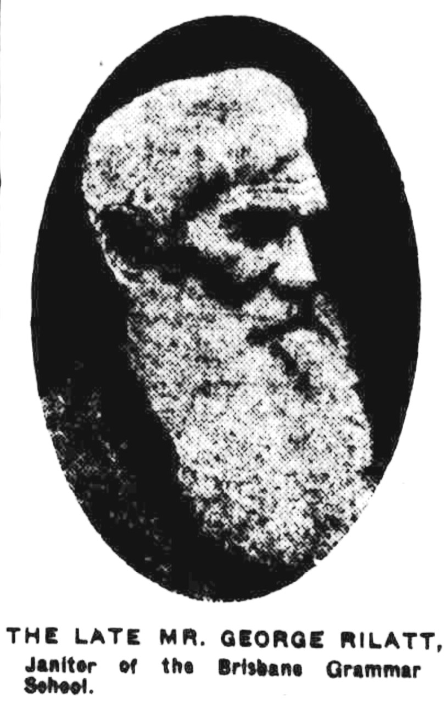

## George Rilatt <small>[(13‑33‑12)](https://brisbane.discovereverafter.com/profile/31903167 "Go to Memorial Information" )</small>

Born in 1844 in Lincolnshire, England, Rilatt came to Queensland aged twenty. He was the dedicated janitor of Brisbane Boys' Grammar School for 51 years from 1872 until his death in 1924, aged 80.

He selected the present site of Brisbane Grammar, built in 1880. As well as performing typical janitor's duties, he ran the tuckshop from the front of his own cottage, conducted the orchestra, attended to the school's banking and was involved in many aspects of school life.

The Old Boys' Association paid tribute to Rilatt's contribution to the school by erecting a [memorial bell](https://monumentaustralia.org.au/themes/people/community/display/118195-george-rilatt) in the school grounds in his honour and a memorial headstone which was dedicated in November 1931.

>... And though the music he so loved around him
>Came stealing with no earth note in the strain,
>He would be happiest if the new life found him
>Among "his boys" again.

[*Brisbane Courier* 16 June 1924](https://trove.nla.gov.au/newspaper/article/20754515)

<figure markdown>
  { width="30%" }
  <figcaption markdown>[George Rilatt](https://trove.nla.gov.au/newspaper/article/20754517) -  The Brisbane Courier, 16 June 1924. Lightened.</figcaption>
</figure>
