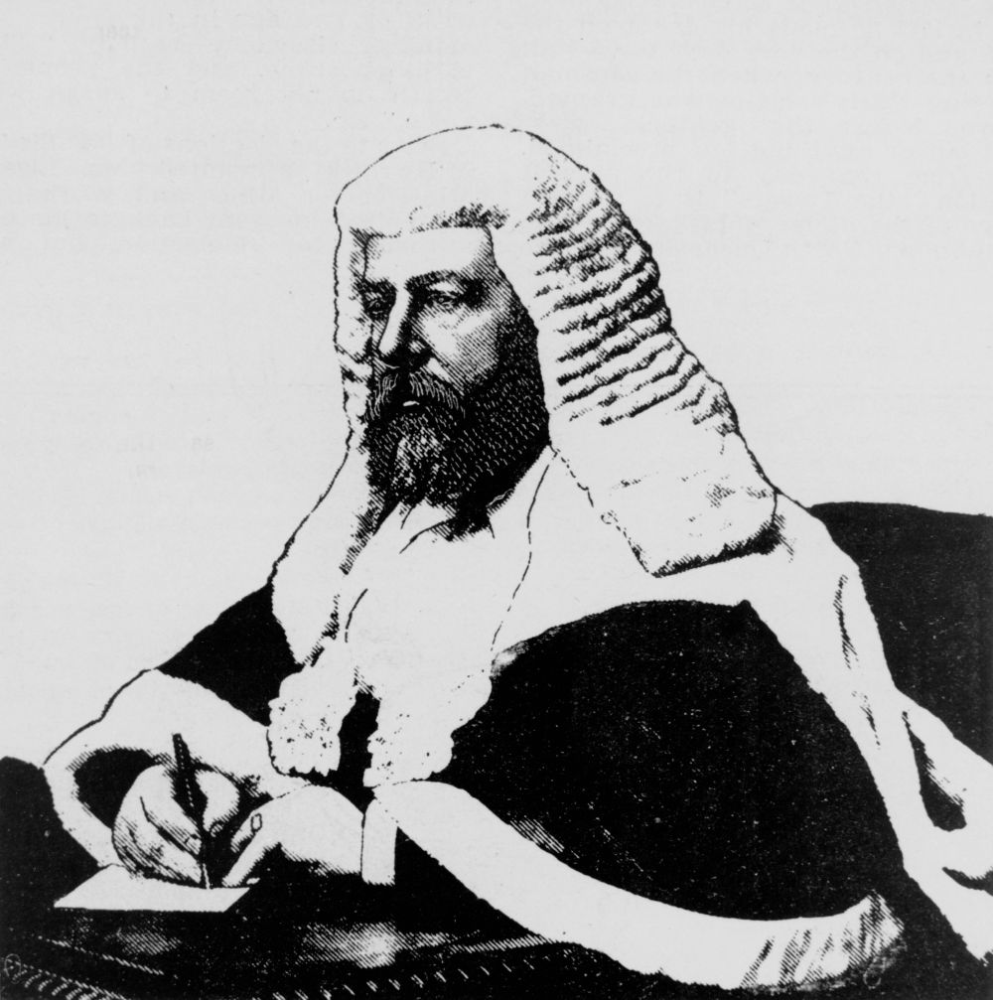

## The Honourable George Rogers Harding <small>(1‑82‑15)</small>

George Rogers Harding (1838-1895) was born at Taunton, Somerset, England, the only son of George Rogers Harding, LL.B., vicar of Gittisham, Devon, and his wife Elizabeth, née Winter. He was called to the Bar in London in 1861. On arrival in Brisbane with his wife in 1866, he was immediately admitted to the Bar, the first equity counsel in the colony. 

In July 1879 he was appointed Senior Puisne Judge of the Supreme Court of Queensland. He was sent to Rockhampton to preside over the trial of the unionists alleged to be leaders of the shearer's strike. He was almost certainly specially selected by the Queensland Government for the task of obtaining convictions against the unionists. 

{ width="40%" }

*<small>[Justice George Rogers Harding, 1895](http://onesearch.slq.qld.gov.au/permalink/f/1upgmng/slq_alma21298089360002061) -  State Library of Queensland</small>*
