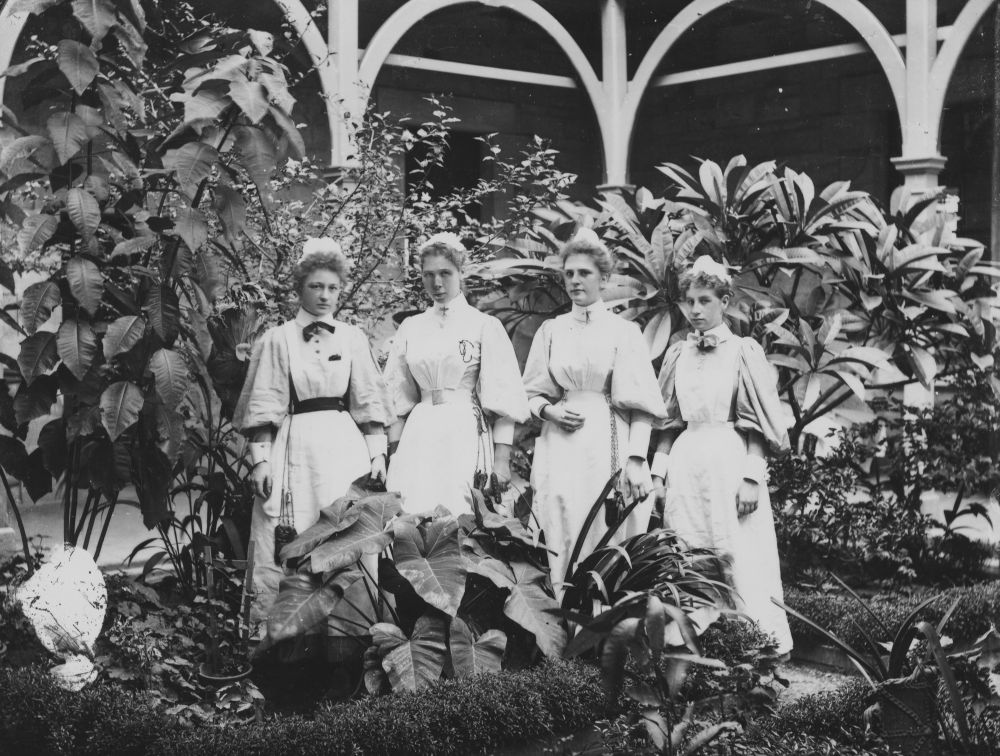

## Gertrude Daly <small>(7A‑171‑1)</small>

Miss Daly worked mainly as a ‘Children’s Nurse’ at the Hospital for Sick Children (HSC), Herston. She was appointed as a registered nurse at the HSC on 22 July 192?. While at the Brisbane Hospital in 1926 she was appointed a sister on 28 September 1926. In October 1926 she returned to the HSC and was appointed a senior sister there on 1 July 1928. 

In the 1930s Gertrude was in charge of the outpatient’s department at the HSC. In 1938 she was granted leave to undertake a four‑month course in child welfare training. She then became Matron of the Metropolitan Hospital for Infectious Diseases from the late 1940s to the early 1950s. On 1 January 1952 she was appointed Matron of the Brisbane Children’s Hospital. After a long illness she died while still in service on 30 October 1961.

{ width="70%" }  

*<small>[Nursing staff in the grounds of the Hospital for Sick Children, Brisbane](http://onesearch.slq.qld.gov.au/permalink/f/1upgmng/slq_alma21218954550002061) — State Library of Queensland.</small>*
