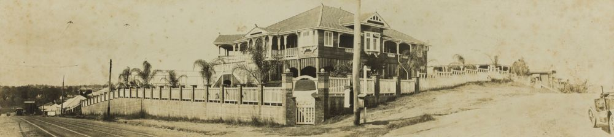

## Glenville Massy <small>(18‑116‑8)</small>

<!-- 13 May 1863 - 25 March 1939 -->

Glenville Massy J.P. was born on the 13th of May 1863. He was the third surviving son of Charles Alphonse Massy, who had four sons and two daughters, all of whom were born at Gundaroo, New South Wales.

Glenville was educated at the Collegiate School, Glebe Point, Sydney, where he studied until he turned seventeen. Owing to an indifferent state of health he did not immediately engage in any particular occupation.

A year later, in 1881, he came to Queensland to join his brothers, Charles and Oscar, at Sonoma, a cattle property owned by them near Bowen. He remained on *Sonoma* for about a year, when, with Charles, he started with a 1000 head of breeders with the view of taking up land on the Lynd, a river which junctions with the Mitchell. On their arrival, however, they learned that the country had already been selected. Their next thought was to obtain pasture for their herd during the advancing wet season.

Glenville stayed with the cattle while Charles inspected down the Mitchell and Palmer Rivers and over the Straaten River Valley, becoming familiar with the the country and potential for grazing. When the roads were again traversable, the brothers mustered their stock and continued their journey to the far north, eventually arriving at the Stuart River, where they took up country 1200 kilometres from where they had started. This land was now known as *Silver Plains*. Its ownership passed to the Queensland Government after the Massys abandoned it when they acquired better country to the west-north-west and moved their stock there. To this property, *Rokeby*, they devoted many strenuous years. Living 160 kilometres from their nearest neighbour, lacking postal and telegraphic facilities, their only means of procuring stores was by packhorse from Cooktown, a distance of 360 kilometres, at a cost of £35 per ton. They sturdily faced floods and droughts and the many indescribable hardships accompanying such events. There was practically no market for their stock and for several years it was impossible to obtain credit from financial institutions.

The Aboriginals constantly killed and harassed the stock and menaced the lives of the settlers. In the efforts of the brothers to halt the attacks by dispersing the Aboriginals, Charles was wounded by a barbed spear which entered his back and became embedded. Glenville helped his older brother to travel over 190 kilometres, but shortly after reaching medical aid Charles died of exhaustion.

Oscar joined Glenville at *Rokeby*. To make it cheaper and quicker to bring in supplies, the Massy brothers pushed a road through to the mouth of the Stuart River. Stores were then transported by sea from Cooktown and then by pack horse at the much reduced rate of £10 per ton. The Queensland Government also used the road for forwarding supplies when building the overland telegraph line to Cape York.

When by 1895 it was imperative to find a market for their increasing herd, Glenville moved to Thursday Island and established a butchering business, which he conducted on his own for the following 14 years as a means of absorbing the *Rokeby* stock. Then the butchering business was floated into a limited company with the title of "The Torres Straits Fresh Food and Ice Company", in which Glenville retained an interest for several years.

In the meantime the firm acquired *Emu Plains*, a run adjoining the original *Sonoma* property. The Massy brothers mutually decided to dissolve the partnership in 1910, Glenville becoming the sole owner of Rokeby and Emu Plains while retaining an interest in Sonoma, which was then administered by Oscar.

That year Glenville Massy retired from North Queensland and took up residence at *Glenville*, on the corner of Milton Road and Hobbs Street, Auchenflower. The house, described as one of the most fashionable of its time, is no longer standing. Glenville spent his days amid comforts which vividly contrast with the frequent privations - such as scarcity of water and lack of food for days at a time - and the many other hardships incidental to a life in the Peninsula.

He married Jessie, daughter of James Hall-Scott, a pioneer of the Bowen district in 1897. Jessie's story is told elsewhere in this book. Glenville died on the 25^th^ of March 1939 at his beloved Auchenflower home.

*<small>[5657 Panorama of a large Queenslander house on the corner of Milton Road and Hobbs Street, Auchenflower. ca. 1920](http://onesearch.slq.qld.gov.au/permalink/f/1upgmng/slq_alma21148712080002061). Part of a motorcar can be seen at the far right of the photo and tram lines and a tram are shown at far left. The house is timber, with a brick and timber fence. The house, named '*Glenville*' was the residence of pastoralist Glenville Massy and his family. The house was demolished in the 1960s. — State Library of Queensland.</small>*

<!--
"Glenville" on the corner of Hobbs Street and Milton Road. Built 1910.
-->

### Acknowledgement

This story was contributed by Hilda Maclean.
