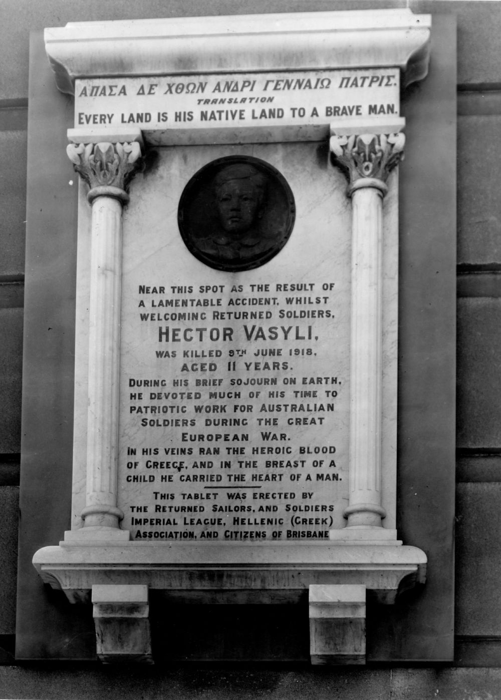
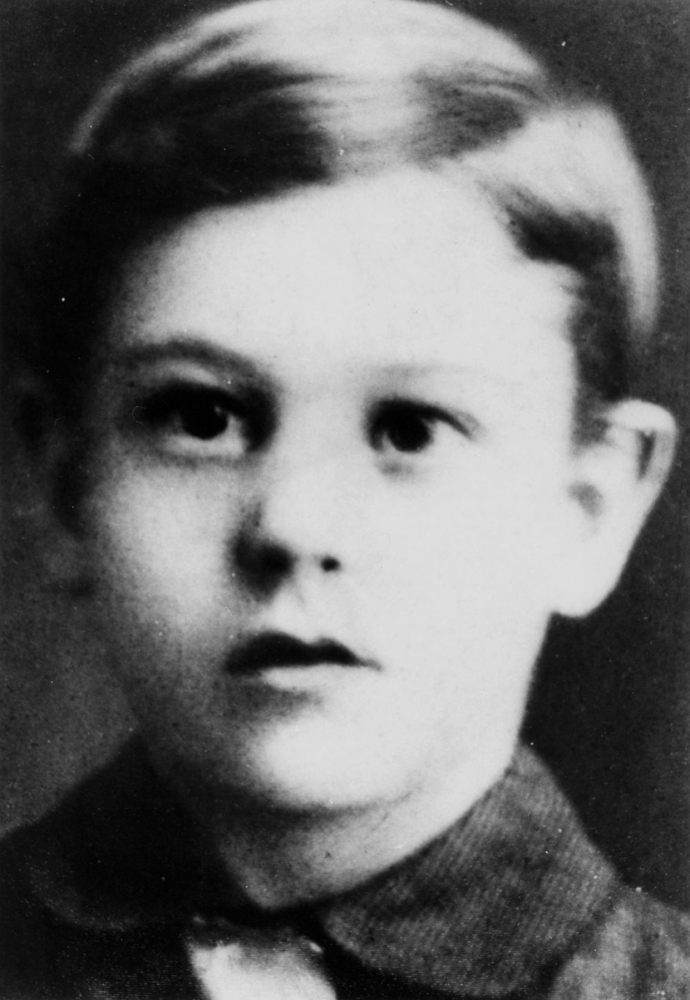

## Hector Vasyli <small>(10‑38‑24)</small>

On Sunday 9 June 1918 a procession of returned servicemen conveyed by motor vehicle left the military hospital at Kangaroo Point headed for Queen Street. About sixty cars made up the motorcade; they were provided and driven by local residents. Four or five young boys had gathered near the southern end of Victoria Bridge. One of these boys was eleven year‑old, Hector Vasyli. His family owned an oyster saloon on Melbourne Street, South Brisbane. Young Hector was very patriotic and known to save up his money to buy presents and throw them to the returned servicemen as they passed by on parade. On the day in question he was doing just that when the tragedy unfolded.

W. J. Jackson, a local produce merchant was the driver of one of the cars. As vehicles ahead of him began to slow down he swerved to avoid a collision. His car went toward the side of the road and struck Hector. The Courier reported that he had *"perfect control of the car"* as he was able to pull it up swiftly after realising what he'd done. Jackson quickly picked up the boy and sped off to St. Helen's hospital. Medical assistance was not immediately obtainable so they left and headed to the Mater Misericordia Public Hospital. It was too late; Hector had succumbed to his injuries (which included a skull fracture, compound fracture to the right arm, and other minor injuries).

The [papers were quick to emancipate Jackson](https://trove.nla.gov.au/newspaper/article/20230566) stating, *"The tragic occurrence was quite unavoidable and Mr. Jackson did everything to avoid the fatal consequences."*

{ width="29.05%" }  { width="28%" }

*<small>[Hector Vasyli Memorial, Brisbane, 1918](http://onesearch.slq.qld.gov.au/permalink/f/1upgmng/slq_alma21218947790002061). Speakers at the unveiling of the tablet include Christy Freeleagus, President of the Hellenic Association, Lieut. Grant Hanlon, Alderman Peter Forrest (Mayor of South Brisbane), and Mr W. P. B. Miles of the Church of England Mission. - State Library of Queensland. </small>*  
*<small>[Hector Vasyli](http://onesearch.slq.qld.gov.au/permalink/f/1upgmng/slq_alma21220256080002061) - State Library of Queensland. </small>*

<!-- TODO add https://trove.nla.gov.au/newspaper/article/188933214 -->
