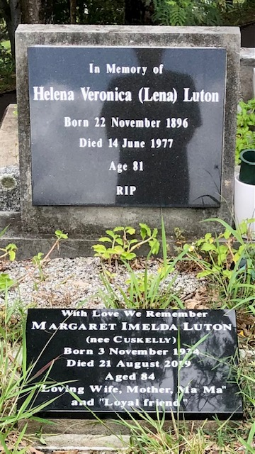

## Helena Veronica Luton <small>(22‑30‑11)</small>

Helena (known as Lena) Luton was with the Australian Army Nursing Service attached to the 1^st^ Australian Infantry Force. She died on 14 June 1977 aged 81.

{ width="40%" }  
