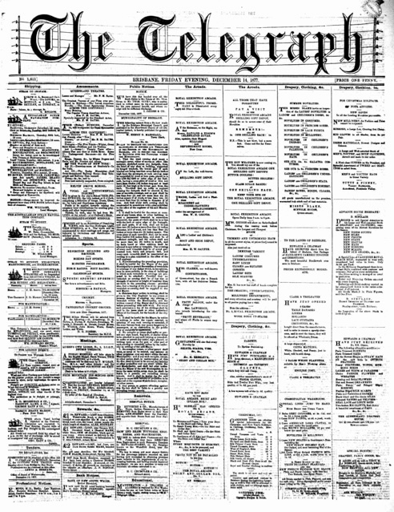

## Henry Beesley <small>[(13‑26‑3)](https://brisbane.discovereverafter.com/profile/32038315 "Go to Memorial Information" )</small>

The Shirt and Collar Box, three doors down from the GPO, was the business of Henry Beesley, a draper who migrated to Queensland in 1870 on the *Indus* with his wife Elizabeth (née Gough). Henry was born on 20 February 1831 in Tewkesbury, Gloucestershire to George Beesley and Eliza (née Hawksley). He died on 5 February 1894 at his home, *Twickenham Lodge*, in West End.

<figure markdown>
  { width="40%"  class="full-width" }
  <figcaption markdown>Advertisments in the [The Telegraph, 14 December 1877](https://trove.nla.gov.au/newspaper/page/19378522) including Herny Beesley's Shirt and Collar Box, Edwards and Chapman, Clark and Treleaven, and Tutty and Finney — National Library of Australia.</figcaption>
</figure>
