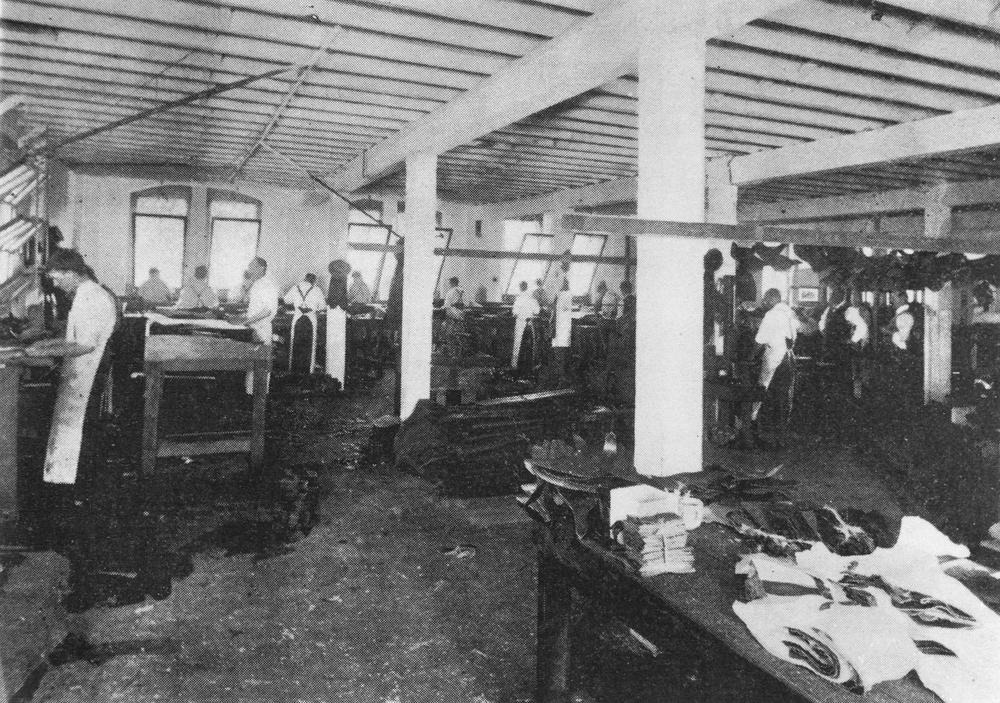
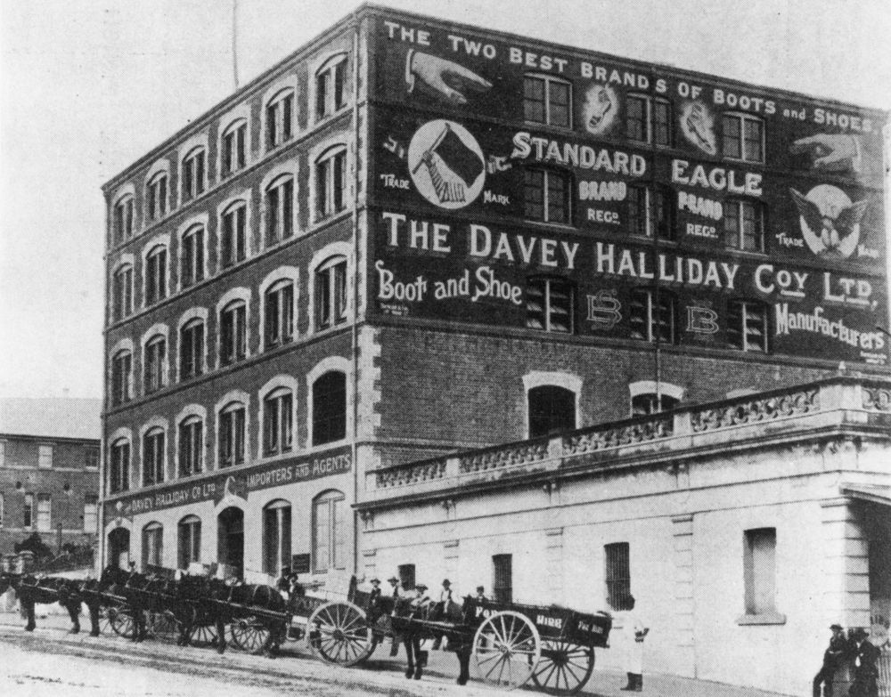

## Henry Lewis Neighbour <small>(2‑44‑19)</small>

Henry was a native of Bethnal Green in London's East End, the son of a silk weaver. His family arrived in Brisbane on the *Whirlwind* in September 1862 when Henry was aged five. After finishing school, Henry entered the boot trade as a 'clicker' cutting the leather uppers and later became foreman at his brother's boot factory in Fortitude Valley. After the business closed, he joined the firm of Davey Halliday Company Ltd. boot manufacturers in Ann Street near the corner with Albert Street. Davey Halliday installed the most modern equipment, driven by a steam engine in their basement, and manufactured all classes of men's, women's children's and infant's footwear. Henry died on 4 August 1942. 

{ width="70%" }  

*<small>[Clicker's department at Davey Halliday & Co, 1904](http://onesearch.slq.qld.gov.au/permalink/f/1upgmng/slq_digitool430702) — State Library of Queensland.</small>*

{ width="70%" }  

*<small>[Davey Halliday Company Ltd. on Ann Street](http://onesearch.slq.qld.gov.au/permalink/f/1upgmng/slq_alma21220086350002061). Carriages outside the Davey Halliday Boot Co. The building was near the corner of Albert Street and Ann Street. This is presently the site of King George Square. Erected 1904 and later part of Albert House. (Information taken from The Queenslander, 14 May 1904) — State Library of Queensland.</small>*
