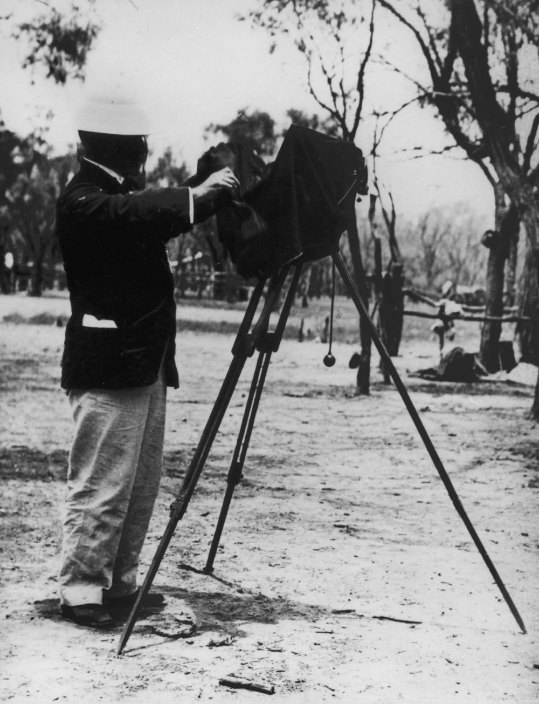

## Henry William Mobsby <small>(5‑61‑11)</small>

Mosby was an artist, photographer and motion picture pioneer. He was born on 17 August 1860 at Hove, Sussex, son of William Mobsby, watchman, and his wife Sarah, née Humphrys. Henry trained in art, design, chemistry and commercial practice at the School of Arts, Brighton, and in London. In 1883 he accompanied artist Isaac Jenner to Queensland. Mobsby married Jenner's eldest daughter Mary Ellen on 10 September 1884 in Brisbane, and for some years taught decorative art at Brisbane Technical College. 

By October 1899 Mobsby had produced some thirty, one‑minute films during various 'still' photography excursions around Queensland. Among the earliest was the arrival of Governor Lamington for the opening of parliament on 18 May 1899. Most of the films made by Mobsby were shot in the spring of 1899 and illustrated wheat harvesting on the Darling Downs, sugar harvesting at Nambour and aspects of stock management. These were the first Australian industrial documentary films and are among the world's earliest films of the type. Mobsby also filmed the Queensland cabinet boarding the government paddle steamer Lucinda for a ministerial banquet. Their last and most impressive films recorded Queensland troops bound for the South African War, the only known surviving footage of such departure shot in Brisbane between 28 and 31 October 1899. 

Mobsby became official artist and photographer for the Department of Agriculture in 1904 and remained until his retirement in 1930. He had scant direct involvement in subsequent Queensland government film production, preferring to commission others, such as the Salvation Army’s former cameraman Sid Cook, to undertake the filmmaking. Mobsby's reputation stemmed from his scenic photography and exhibition design. A fellow of both the Royal Geographical Society and the Royal Society of Artists, London, he regularly designed and organised Queensland's exhibits for the annual shows in southern capitals and at the Royal National Exhibition in Brisbane. His photography gained international distinction, and he officially represented Queensland at numerous exhibitions. 

In December 1905 Mobsby's 11‑year‑old son [Arthur Timewell drowned](https://trove.nla.gov.au/newspaper/article/184680167?searchTerm=Arthur%20Timewell%20Mobsby); each year thereafter, the Mobsby memorial medal was awarded to the Indooroopilly State School student who achieved the highest percentage in the year 8 scholarship public examination. A keen Freemason, Mobsby was a member of the Lodge, Indooroopilly, No.155, United Grand Lodge of Queensland. [He died on 9 April 1933](https://trove.nla.gov.au/newspaper/article/22150093) at his home in Station Road, Indooroopilly, and was buried with his son.

<!--
- https://www.couriermail.com.au/questnews/little-boy-honoured-112-years-after-he-drowned-in-a-brisbane-flood/news-story/ee8ea5e767831d9a9c27da8af535a7e3
- https://www.flickr.com/photos/hwmobs/24888797078/in/photostream/
- https://trove.nla.gov.au/newspaper/article/19703747
-->

{ width="40%" }  

*<small>[Photographer Henry William Mobsby, Barcaldine, ca. 1905](http://onesearch.slq.qld.gov.au/permalink/f/1upgmng/slq_alma21250438610002061) - State Library of Queensland </small>* 
