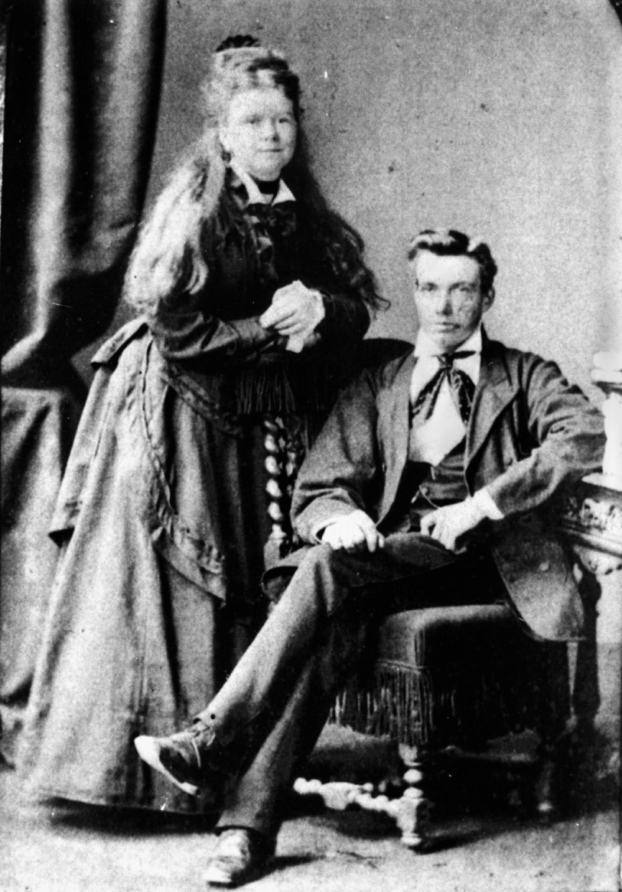

## Hercules Smith <small>(5‑40‑9)</small>

Hercules was the second principal of the Toowong State School, a position he held for 27 years from January 1882 until retirement in March 1909.

{ width="40%" }

*<small>[Anne and Hercules Smith](http://onesearch.slq.qld.gov.au/permalink/f/1upgmng/slq_alma21218860780002061) - State Library of Queensland </small>*
