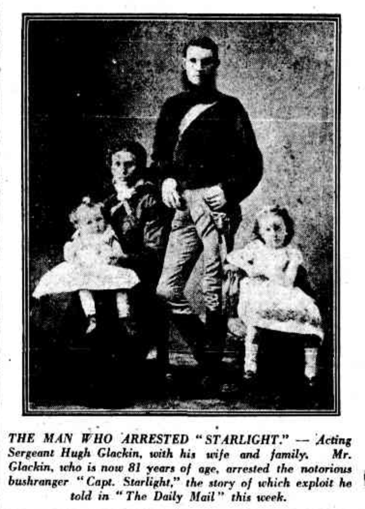
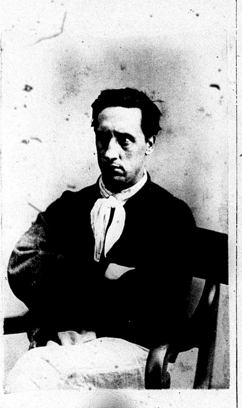

## Hugh Glackin <small>[(15‑22‑20/21)](https://brisbane.discovereverafter.com/profile/31820210 "Go to Memorial Information" )</small>

Hugh Glackin was born in Newtown Cunningham in County Donegal on 18 March 1844. After coming to Queensland, he joined the police force as a constable in 1870 and [famously arrested Captain Starlight](https://trove.nla.gov.au/newspaper/article/181459438) in April 1887. 

{ width="35%" }
{ width="28%" }

*<small>[Hugh Glackin and familiy](https://trove.nla.gov.au/newspaper/article/219446603) - The Daily Mail, 27 Sep 1924</small>*  
*<small>[Frank Pearson](https://search.records.nsw.gov.au/permalink/f/1ebnd1l/INDEX2058217) (Captain Starlight) - State Archives of NSW</small>*
