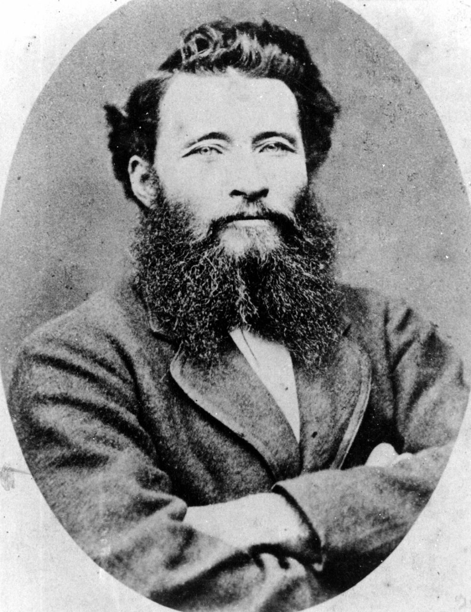

## Hugh Mosman <small>(13‑88‑3)</small>

Hugh Mosman was born on 11 February 1843 to Archibald Mosman and Harriet (née Farquharson). Hugh headed to Queensland in 1860, attracted by the pastoral boom. Hugh turned to prospecting in the Ravenswood area when the economy declined. Hugh's Aboriginal servant, young Jupiter Mosman, is credited with the gold discovery at the place Hugh subsequently named Charters Towers. 

Hugh was a member of Queensland's Legislative Council from 27 June 1891 until his resignation on 17 January 1905. Hugh, a brother-in-law to Sir Thomas Mcllwraith and Sir Arthur Palmer, died at his residence Eastern Gray, Toowong on 15 November 1909.

{ width="40%" } 

*<small>[Hugh Mosman](http://onesearch.slq.qld.gov.au/permalink/f/1upgmng/slq_alma21220442580002061) - State Library of Queensland </small>*  
