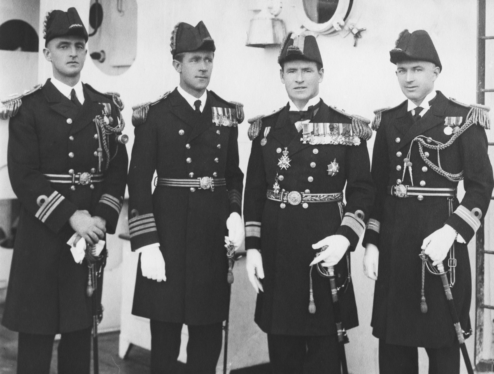

## Commander: Ian Chesborough Rose MacDonald <small>(11‑52‑12)</small>

Born to Alexander Chesborough Rose MacDonald and Nancy Armitage in Hamilton Brisbane. Married Gertrude Courtney Dix, St George’s, Hanover Square, London April 1927. Midshipman on *H.M.S. Agincourt* 1917.

<figure markdown>
  { width="70%" }
  <figcaption markdown>[Left: Flag Lieutenant Commander ICR Macdonald RAN](https://www.navy.gov.au/biography/admiral-edward-ratcliffe-garth-evans) -  © Commonwealth of Australia - Department of Defence</figcaption>
</figure>

<!--
http://heritage.saintandrews.org.au/ian-chesborough-rose-macdonald/ 
-->