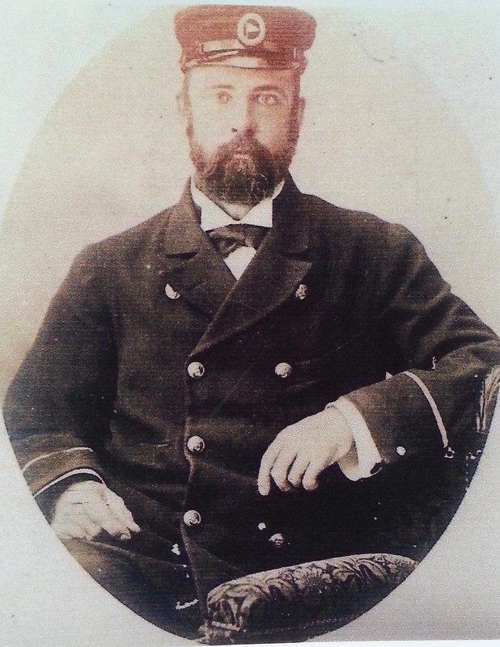

## Isaac Walter Jenner <small>[(5‑43‑16)](https://brisbane.discovereverafter.com/profile/31751308 "Go to Memorial Information" )</small>

<!-- TODO  Walter Isaac Jenner in Extraordinary Stories -->

Jenner was born on 18 March 1837 at Brighton, Sussex, son of Thomas Jenner, blacksmith, and his wife Harriet, née Walter. Without known formal education, he worked on oyster boats and signed on for a voyage in Arctic waters. In March 1855 he joined the Royal Navy, serving during the Crimean War in the Black Sea. Discharged in 1865, he learned to paint and worked as a landscape and marine painter in 1873‑79 at Brighton and at Hove in 1880‑83. He exhibited at Brighton and once at the Royal Academy. He decided to migrate and reached Brisbane by R.M.S. Roma on 19 September 1883.

Jenner made a living by selling paintings, holding art unions and teaching at Miss O'Connor's School, Oxley, and at the Brisbane Technical College in 1887‑89. Although he travelled in New South Wales and New Zealand in 1889, he exhibited only in Brisbane and at the Centennial International Exhibition of 1888‑89 in Melbourne. He had helped to found the Queensland Art Society in 1887. He moved his studio in 1890 to Montrose Road, Taringa, where he lived and worked for the rest of his life.

A self‑taught marine and landscape painter of considerable ability and technical skill, [Jenner painted local scenery and continued all his life to paint English scenes from memory](https://collection.qagoma.qld.gov.au/creators/jenner-isaac-walter). His most popular subjects were the Sussex and Cornish coasts and large historical seascapes. In 1895 he gave one of his large seascapes, 'Cape Chudleigh, Labrador' (1890) to the Queensland National Gallery soon after its opening.

He died at Taringa on 1 March 1902. He was survived by his wife Mary, née Jenkins, whom he had married on 23 May 1860 at Anthony, Cornwall, and by three sons and three daughters.

{ width=40% }

*<small>[Marine artist - Isaac Walter Jenner (1836 - 1902)](https://www.flickr.com/photos/hwmobs/24099076204/in/photolist-kkpHXP-khd4co-khb8iH-khbbhi-khcYKs-khaDfk-baDQKF-baD5JF-khaART-khd1Ku-khayuP-kkpnLZ-baDu2X-baDRpk-aTc7yZ-DF4G8V-CHy4KS-b9t9ft-RovtrX-CHEVka-271vxfL-kzKg7S-CGVjTN-2kU37nf-RjMAkL-oxDp7D-kzHcNR-aZ89Vk-kzKe17-kkskCo-aTbPoM-onUteY-Qh2j5i-kh8SU6-kzHdiP-qASfYq-2bby845). Aussie~mobs.</small>*

<!-- Kym Hyson suggests this story was contributed by Frances Pavlu. This is in The Artists walk which has no such attribution. Relates to discussion about attribution of prior work.   -->
