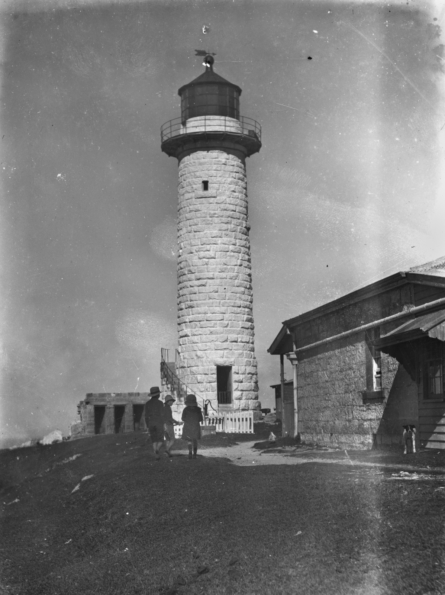

## James Brayden <small>[(13‑38‑11)](https://brisbane.discovereverafter.com/profile/31685764 "Go to Memorial Information" )</small>

James Brayden (1827-1890), the first Superintendent of the Cape Moreton Lighthouse was born at Ramsay on the Isle of Man, the son of George Brayden and Mary (née Bell). The lighthouse was built by the NSW Government prior to Separation. James served at Cape Moreton for 31 years before retiring to New Farm in Brisbane. During his tenure at Cape Moreton he provided meteorological observations to the Government Meteorological Observer. 

<figure markdown>
  { width="40%" }
  <figcaption markdown>[Three young children playing in the shadows of Cape Moreton Lighthouse, Moreton Island, ca. 1912](https://onesearch.slq.qld.gov.au/permalink/61SLQ_INST/dls06p/alma99183513362602061) — State Library of Queensland</figcaption>
</figure>