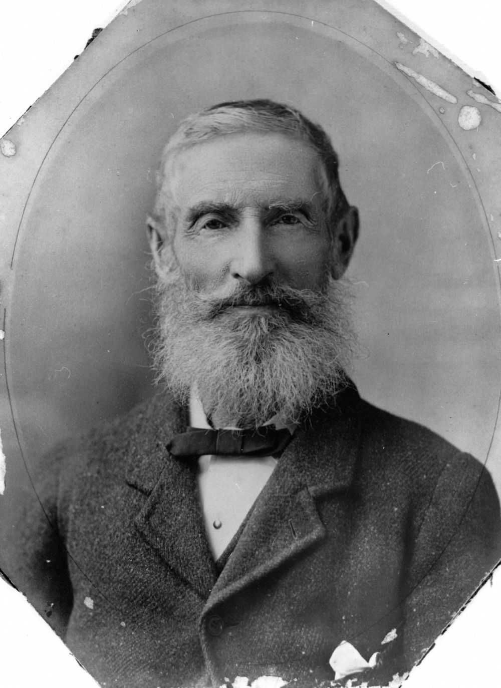

## James Campbell <small>(12‑15‑4)</small>

4 November 1838 - 13 September 1925

## Sarah Ann Campbell <small>(12‑15‑4)</small>

March 1845 - 20 July 1935

James Campbell was born on the 4^th^ of November 1838 at Newtown, Cooks River, Sydney, New South Wales. He was baptised on the 22^nd^ of December 1838 at Scots Church of St Andrew, Sydney. James was the fifth child and fourth son of Hugh and Ellen Campbell.

James left Sydney with his brothers Charles and William to make their home in Toowoomba. He was first connected with Eton Vale. In 1867 he went into business for himself, later taking his two brothers into partnership in the butchery and wool scouring business of J. C. and W. Campbell, situated on the corner of Ruthven and Russell Streets, Toowoomba.

James was interested in politics like his father Hugh and his brother Charles. He became Alderman of Toowoomba, Mayor in 1882, and finally MLA for Aubigny from March 1884 to April 1893, elected unopposed after the election of the 6^th^ of March 1883 was declared null and void. He was also a member of the Toowoomba Caledonian Building Society and foundation member of the Southern Cross Masonic Lodge.

He owned a grazing property, *Dulacca West*, near Yeulba in 1899. He was said to be an accomplished cattleman. He retired to his home *Portland* at Toowoomba and his other home also called *Portland* in Brisbane in 1915.

It was James Campbell's proud boast that he had been a subscriber of the Brisbane Courier for 55 years.

James married Sarah Ann Lovell on the 17^th^ of April 1866 at Toowoomba. Sarah hailed from Bristol, where she was born in March 1845. She came to Australia with her parents on the *Blenheim* in 1858. The Lovell family first settled in Ipswich then later moved to Toowoomba. Sarah's father, Richard Lovell, was a wheelwright and prominent citizen of Toowoomba. Her mother, Ann, was a member of the Gregory family.

James died on the 13^th^ of September 1925 at his Brisbane home of jaw cancer. Sarah died almost ten years later on the 20^th^ of July 1935 at their Toowoomba home. They are buried together at Toowong Cemetery. 

James and Sarah had twelve children, four sons, seven daughters and a baby who died unnamed. At the time of his death in 1925, James had 33 grandchildren and five great-grandchildren.

{ width="40%" }

*<small>[James Campbell](http://onesearch.slq.qld.gov.au/permalink/f/1upgmng/slq_alma21218626290002061) — State Library of Queensland.</small>*

### Acknowledgement

This story was contributed by Ian Campbell.
