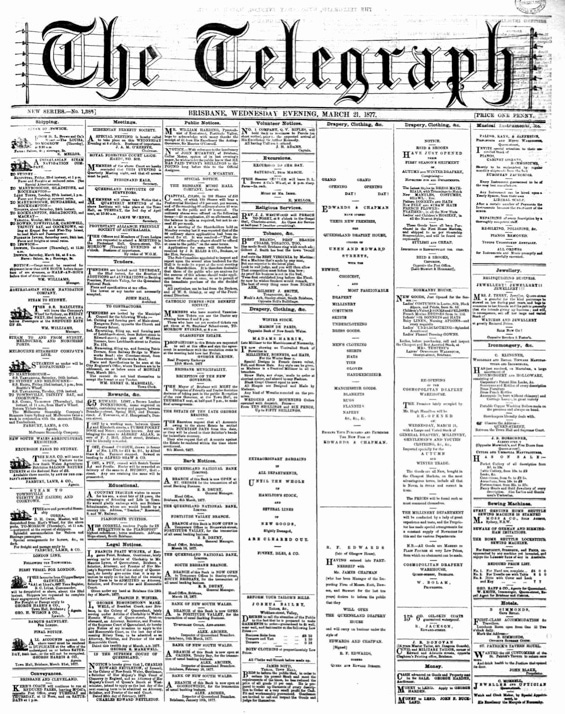

## James Chapman <small>[(13‑83‑6/7)](https://brisbane.discovereverafter.com/profile/32012642 "Go to Memorial Information" )</small>

Soft goods merchant, James Chapman was born in Perthshire, Scotland where he commenced his commercial career before migrating to Queensland arriving in August 1864 in the ship *Earl Russell*. With Richard Edwards, he was a partner in the firm of [Edwards and Chapman](https://trove.nla.gov.au/newspaper/article/181787104?searchTerm=%22Edwards%20Chapman%22). He died at his residence *Kintullo* Gregory Terrace on 4 May 1917.

<!-- 
https://trove.nla.gov.au/newspaper/article/196937137 1890 
-->

<figure markdown>
  { width="40%"  class="full-width" }
  <figcaption markdown>Queensland Drapery House opening full column advertisment in the [The Telegraph, 21 March 1877](https://trove.nla.gov.au/newspaper/page/19379817) - National Library of Australia.</figcaption>
</figure>
