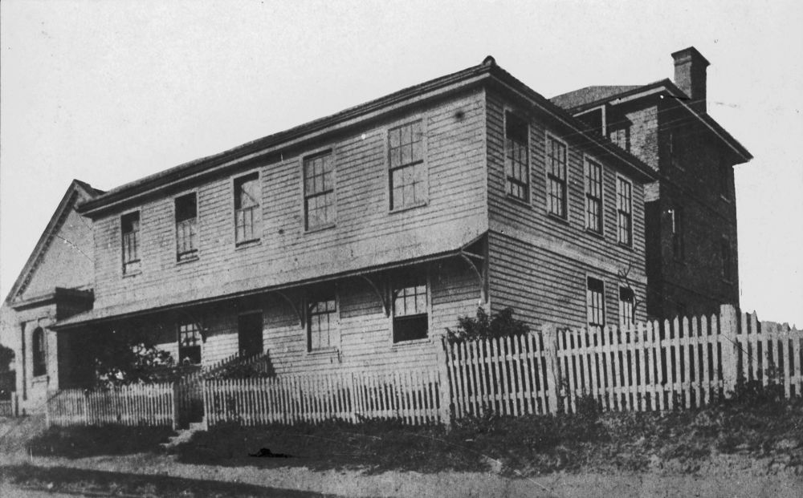
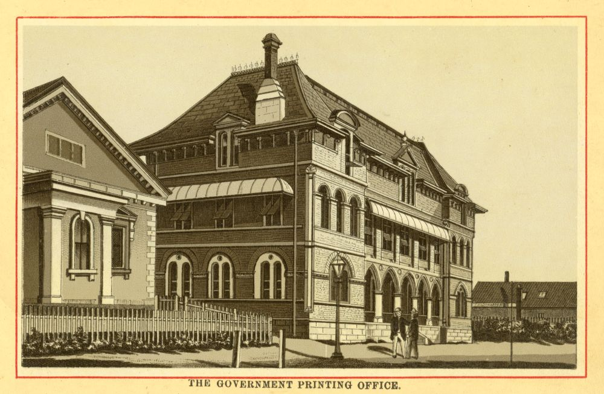

## James Charles Beal <small>(7‑41‑18)</small>

James Beal was born in 1833 in Sydney where he served his apprenticeship at the *Sydney Morning Herald*. He came to Brisbane in 1862 to take up the position of Superintendent at the Government Printing Office where he was promoted to the position of Government Printer in 1867 and held that position until his retirement at the end of 1893. Outdoor exercise was recommended for printers for health reasons and James was involved in various sporting circles. He died on 24 August 1904 following a bout of influenza.

{ width="47.4%" }
{ width="45%" }

<small>[Queensland's first Government Printing Office, Brisbane, ca. 1869](http://onesearch.slq.qld.gov.au/permalink/f/1upgmng/slq_alma21218169560002061) - State Library of Queensland</small>  
<small>[Government Printing Office, Brisbane, ca. 1883](http://onesearch.slq.qld.gov.au/permalink/f/1upgmng/slq_alma21271316800002061) - State Library of Queensland</small>
