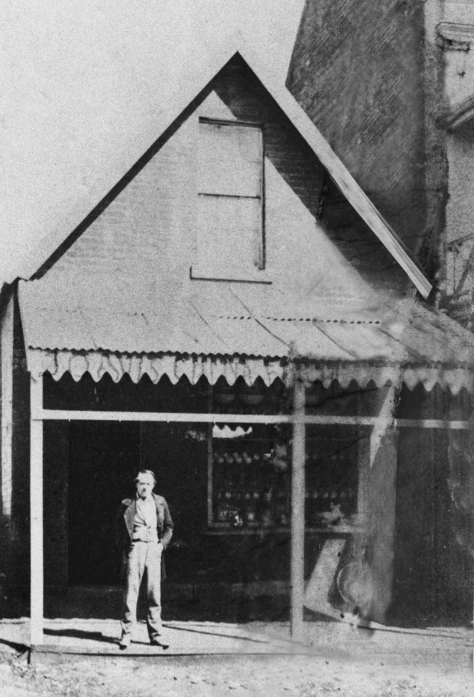

## James Davis (Duramboi) <small>(7‑5‑15)</small>

James Davis was born in Broomielaw, Scotland, and at 14 was apprenticed to his father as a blacksmith at Old Wynd, Glasgow. Convicted two years later for stealing 2s. 6d. from a church box in Surrey, he was sentenced to be transported for seven years, and in August 1825 arrived in New South Wales in the *Norfolk*. His next appearance in court was at Patrick's Plains, where in 1828 he was charged with robbery and sentenced to three years at Moreton Bay as a doubly convicted felon. He arrived there on 18 February 1829 and absconded six weeks later. The escapees soon met a party of Aboriginals whose chief, Pamby‑Pamby, claimed Davis as his dead son returned to life as a white man. As Duramboi, Davis took easily to tribal life. An honoured guest, he was allowed to move freely from one tribe to another, his travels taking him hundreds of miles from Brisbane. He had learnt the languages and customs of many tribes before he was found at Wide Bay in 1842 by Andrew Petrie and with difficulty assured that he could return safely to Brisbane as the convict settlement had ended.

He had to relearn the English language and accustom himself again to work and clothes. He was employed at first by Dr Stephen Simpson, the land commissioner in Moreton Bay; later he set up as a blacksmith at Kangaroo Point. In 1864 he opened a crockery shop in George Street, Brisbane, where he made money, although literate enough only to sign his name. He had married Annie Shea on 3 November 1846. After her death in 1882, he married on 28 July 1883 Irish‑born widow, Bridget Hayes. He died on 7 May 1889.

His rehabilitation into acquisitive society included reform; from his accumulated estate the Brisbane General Hospital received £750 in 1889 and another £1100 in 1911. He guided settlers to good land in the Wide Bay area, and some public benefit came from his thirteen years with the Aboriginals. He was occasionally employed as a court interpreter, and in 1866 petitioned the governor to raise his salary to the £20 paid to Chinese and German interpreters, but his request was refused.

{ width="40%" }  

*<small>[James Davis poses in front of his crockery store, George Street, Brisbane, ca. 1872](http://onesearch.slq.qld.gov.au/permalink/f/1upgmng/slq_alma21218687340002061) — State Library of Queensland.</small>*
