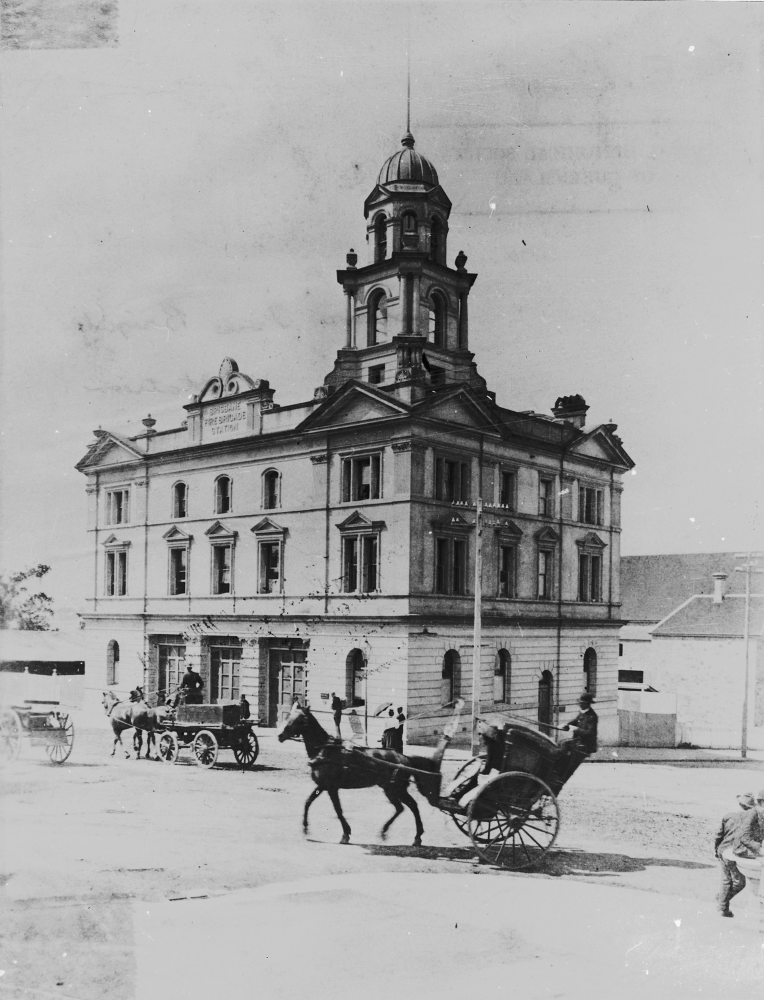
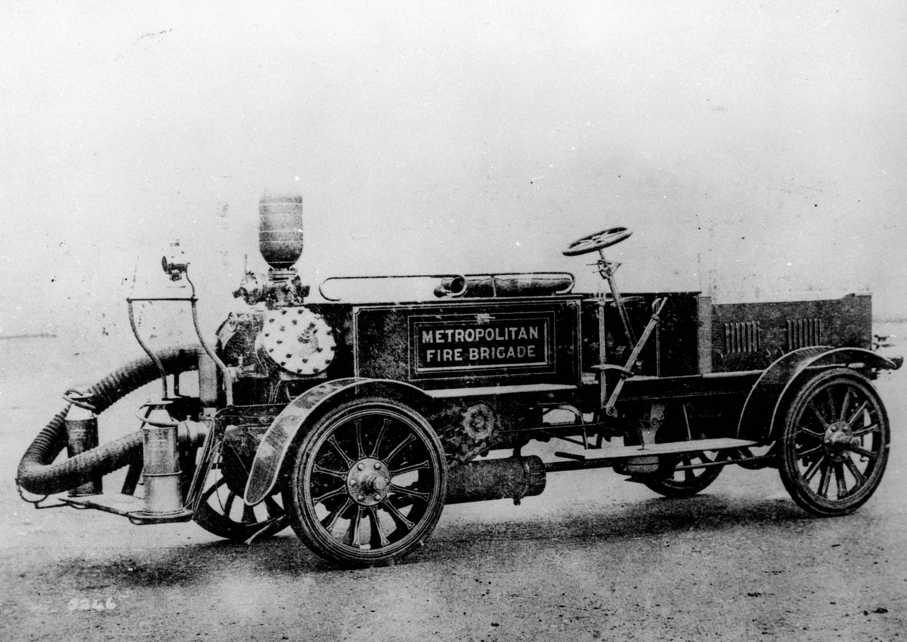

## James Dunbar <small>[(1‑8‑14)](https://brisbane.discovereverafter.com/profile/31891245 "Go to Memorial Information" )</small>

James Dunbar (ca. 1837-1920) was appointed station keeper at the Central Fire Station in Edward Street in 1867 and was [the oldest known fireman in Brisbane](https://trove.nla.gov.au/newspaper/article/179640595) when he died at the age of 83 on 22 November 1920. His service spanned the period from when hand drawn fire appliances were used to the introduction of motor fire trucks.

<figure markdown>
  { width="40%" class="full-width" }
  <figcaption markdown>[Brisbane Fire Brigade Station, ca. 1899](https://onesearch.slq.qld.gov.au/permalink/61SLQ_INST/1dejkfd/alma99183513704502061). Erected on the north east corner of Ann and Edward Street in 1890.  — State Library of Queensland.</figcaption>
</figure>

<figure markdown>
  { width="70%" class="full-width" }
  <figcaption markdown>[Merryweather chemical fire engine ca. 1905](https://onesearch.slq.qld.gov.au/permalink/61SLQ_INST/tqqf2h/alma99184004871002061). Brisbane's first motorised firefighting vehicle. — State Library of Queensland.</figcaption>
</figure>
