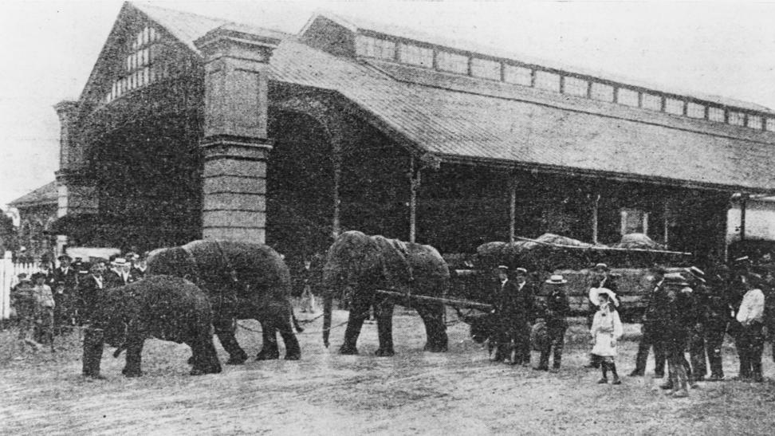

## James Edwin Ramsbotham <small>(15‑16‑17)</small>

James Ramsbotham was born on 4 November 1856 in Ipswich Qld where his parents were well known residents. He entered the Posts & Telegraphs Service and was stationed at St Lawrence. Later he moved to Brisbane. In 1901 following Federation he was appointed to the position of [telegraphist at Roma Street Railway Station](https://trove.nla.gov.au/newspaper/article/201060931).

*<small>[Wirth Brothers' elephants drawing the circus properties from Roma Street Railway Station, 1905](http://onesearch.slq.qld.gov.au/permalink/f/1upgmng/slq_digitool88516) - State Library of Queensland. Cropped.</small>*
