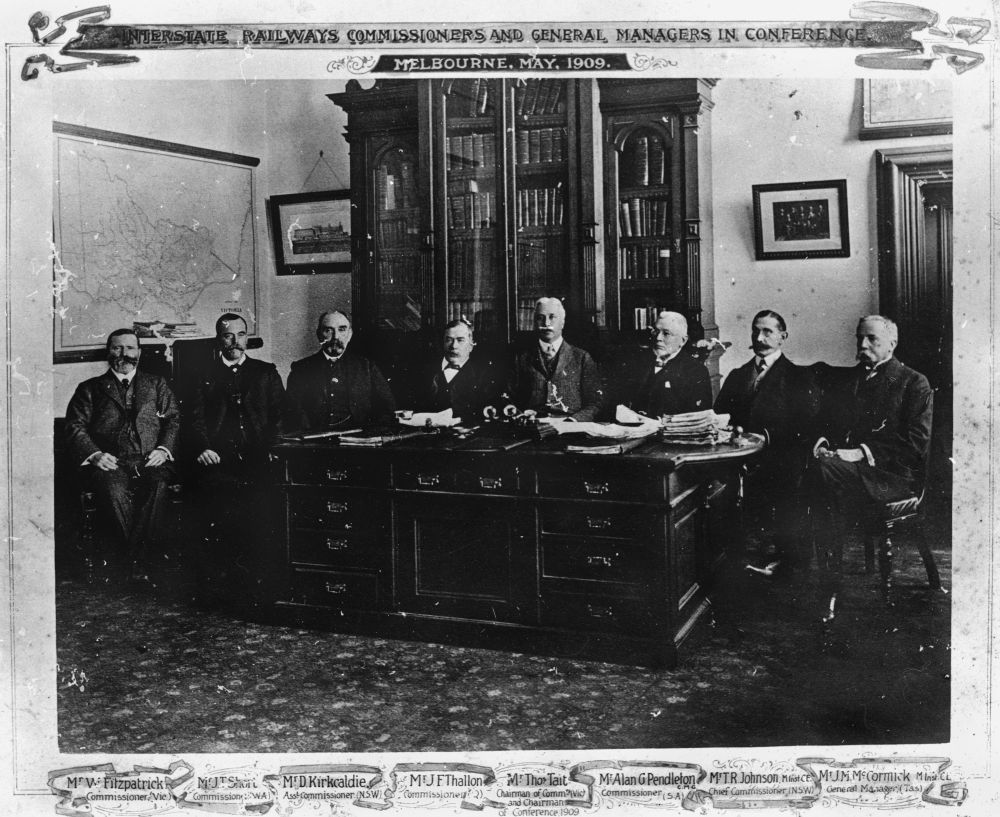
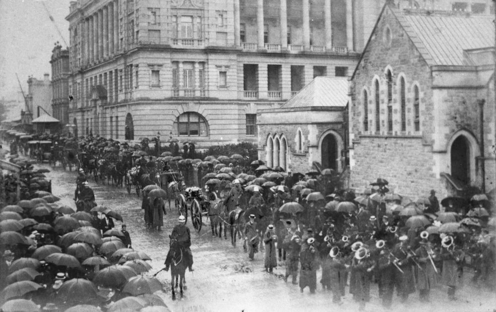

## Lieutenant‑Colonel James Forsyth Thallon <small>(11‑71‑14)</small>

The son of a Scottish engineer, Robert Thallon and his wife, Jean née Forsayth, James Forsyth Thallon was the Queensland Commissioner for Railways from 1902 to 1911. He was born in Markinch, in Fifeshire, Scotland in 1847 and entered the railways in Edinburgh as a 15-year-old apprentice. He came to Queensland in 1882 to take up a management position in the Southern and Western Railways. After his death in 1911, subscriptions were collected from railways employees for the erection of a memorial over his grave. The Thallon Memorial Medal was awarded annually to the children of railway employees who received the highest marks in the Junior Examination.

{ width="42%" }  { width="54.5%" }   

*<small>[James F, Thallon](http://onesearch.slq.qld.gov.au/permalink/f/1upgmng/slq_alma21220418430002061), Queensland Railways Commissioner, at the interstate railway commissioners and general managers' conference Melbourne in May 1909 - State Library of Queensland </small>*  
*<small>[State funeral for James Forsyth Thallon, Queensland Commissioner for Railways, Brisbane, Queensland, 27 March 1911](http://onesearch.slq.qld.gov.au/permalink/f/1upgmng/slq_alma21218753520002061), 1915 - State Library of Queensland </small>*  
