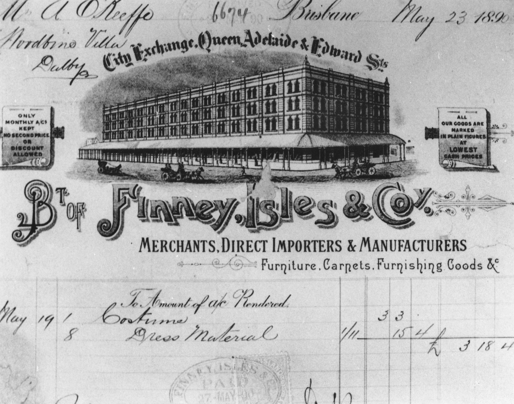

## James Isles <small>(13‑81‑5)</small>

James Isles of Finney Isles & Co was born in Scone, Scotland in 1837, the son of William and Isabella Isles and had been in business with Thomas Finney in Dublin before coming to Brisbane. James died from the effects of a stroke at his Clayfield residence on 3 November 1888 at the age of 51 without having seen Finney Isles & Co's new buildings on the corner of Adelaide & Edward Streets completed.

<figure markdown>
  { width="70%"  class="full-width" }
  <figcaption markdown>[Letterhead showing Finney, Isles & Co. building at the corner of Queen Adelaide and Edward Streets, Brisbane, 1890](https://onesearch.slq.qld.gov.au/permalink/61SLQ_INST/dls06p/alma99183512686402061) — State Library of Queensland.</figcaption>
</figure>
