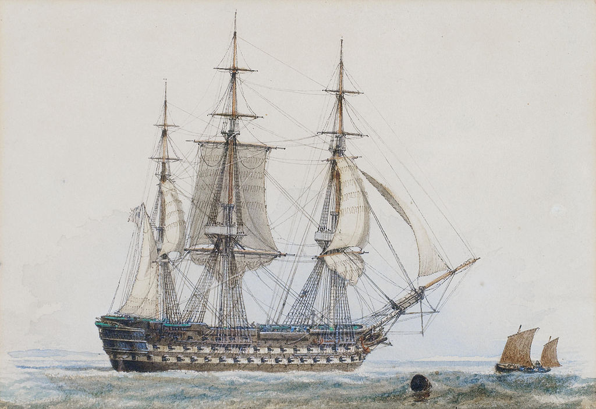

## Petty Officer: James Kirk <small>[(13‑59‑8)](https://brisbane.discovereverafter.com/profile/31893922 "Go to Memorial Information" )</small>

Born 14 July 1838 in Dunchalt, Fifeshire, Scotland. Various ships have him as Carpenter and others Petty Officer. While in station in Australia he was on the *H.M.S. Asia* and the *H.M.S. Pearl*.

<figure markdown>
  { width="70%" class="full-width" }
  <figcaption markdown>[Watercolour painting of H.M.S. Asia by John Ward](https://en.wikipedia.org/wiki/HMS_Asia_(1824))</figcaption>
</figure>