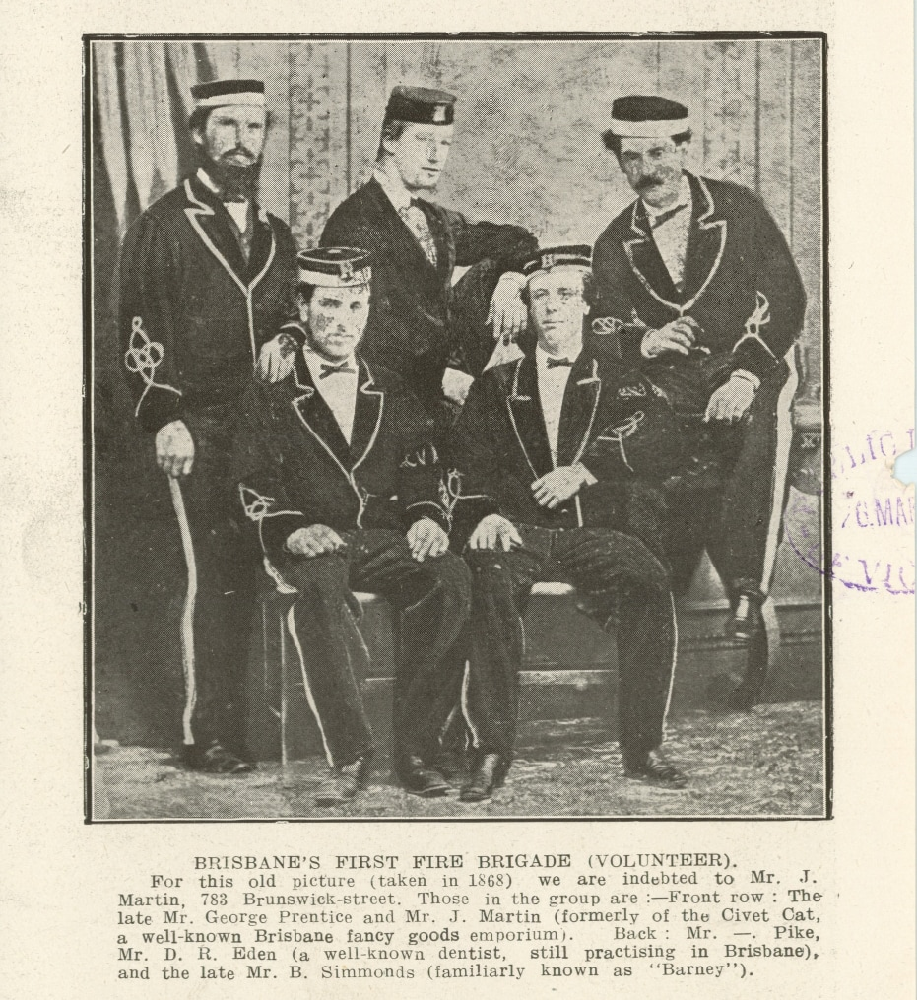

## James Martin <small>[(13‑24‑21)](https://brisbane.discovereverafter.com/profile/31724210 "Go to Memorial Information" )</small>

The Civet Cat fancy goods and toy emporium stood in Queen Street where the Myer Centre is today. Its proprietor, James Martin was born in Worcestershire in 1838 to parents, Joseph Martin and Elizabeth (née Teague). He married Henrietta Bradshaw in Brisbane in 1869. [James died at the age of 89](https://trove.nla.gov.au/newspaper/article/180790667) at his home *Mascotte* at New Farm on 25 November 1927

<figure markdown>
  { width="40%"  class="full-width" }
  <figcaption markdown>James Martin and George Prentice were members of Brisbane's first fire brigade in 1868. From [Page 22 of The Queenslander Pictorial, supplement to The Queenslander, 24 March 1917](https://onesearch.slq.qld.gov.au/permalink/61SLQ_INST/tqqf2h/alma99183906327202061) — State Library of Queensland. Cropped.</figcaption>
</figure>
