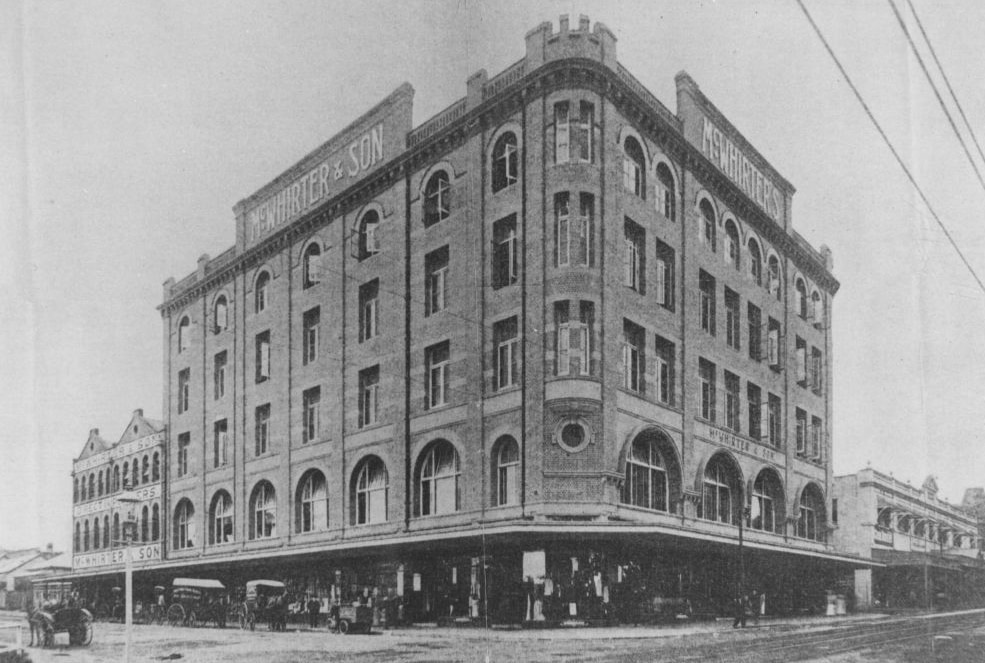

## James McWhirter <small>(18‑98‑3/7)</small> 

<!-- 1878‑1919 -->

James McWhirter (junior), the only son of James and Agnes McWhirter (née Cameron), played a significant part in developing the centre of Fortitude Valley, working with his father to build a premier shopping precinct, which is now a [Queensland heritage‑listed place](https://apps.des.qld.gov.au/heritage-register/detail/?id=600214).  

James McWhirter (junior) was born in 1878 in Scotland. His father and mother immigrated to Australia that same year. He married Adelaide Mary Reid in January 1906, but she died tragically nine months later, giving birth to their son Duncan. He remarried in 1910 to Mary Millicent Atkins and had several children with her. 

Encouraged by the new styles of shopping in London, the McWhirters commissioned Brisbane architects Atkinson and McLay to design a substantial, five‑storey building. When completed in 1912 it became an immediate Fortitude Valley landmark, seen for miles around, and dominating the Valley corner.  No expense had been spared and on its opening in October 1912, delivered the most modern and progressive of department stores. On the ground level, extensive street frontages displayed the latest in island windows and the five street entrances displayed mosaic tiling and lead lights in the main foyer. The interior was well‑ventilated and well‑lit and completed with fittings of silky oak display tables which allowed customers to browse and inspect goods without being dependent on sales assistants.

McWhirters was also one of the first department stores fitted with sprinkler systems for fire prevention and three electric elevators for the convenience of customers. The pneumatic cash tube system was also the largest in the state. The grand new store housed more than 50 departments, including manchester, fabric, haberdashery, jewellery, travel goods, and of course millinery and women's clothing as well as furniture, carpets, kitchenware and toys. For the convenience of customers, a tea room also overlooked the Brisbane River and suburbs. 

James McWhirter (junior) died in Sydney in September 1919 of pneumonia. Such was McWhirter’s popularity and standing in Brisbane’s social elite that his funeral was held in Brisbane on 19 September 1919 at the Ann Street Presbyterian Church, with many would‑be attendees unable to be admitted into the church due to lack of space. He was survived by his father, James McWhirter Senior, his widow and children.

{ width="90%" }

*<small>[McWhirter's department store in Fortitude Valley, 1913](http://onesearch.slq.qld.gov.au/permalink/f/1upgmng/slq_alma21298085210002061) - State Library of Queensland. </small>*
