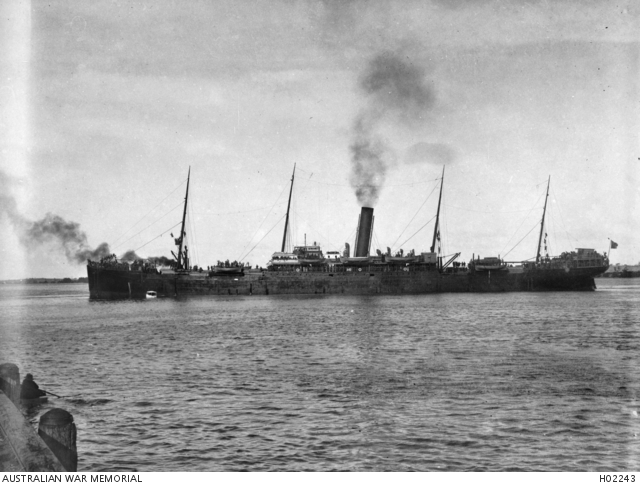

## Private James Sanford M.M. <small>(2A‑24‑1/2)</small>

Service Number: 5753. 9^th^ Battalion 

James was born on 9 September 1888 nearby at Redhill to James and Emily Ann (née Andrews). He enlisted 10 February 1916 in Cairns and after training, embarked on *HMAT SEANG CHOON (A49)* on 4 May 1916.

{ width="70%" }  

*<small>[Troopship SEANG CHOON (A49) shortly after leaving Pinkenba Wharf](https://www.awm.gov.au/collection/H02243), Brisbane, Queensland. ca. 1915. This ship was later torpedoed and sunk off the Irish coast, near Fastnet, on 10 July 1917. — Australian War Memorial - Public Domain</small>*
