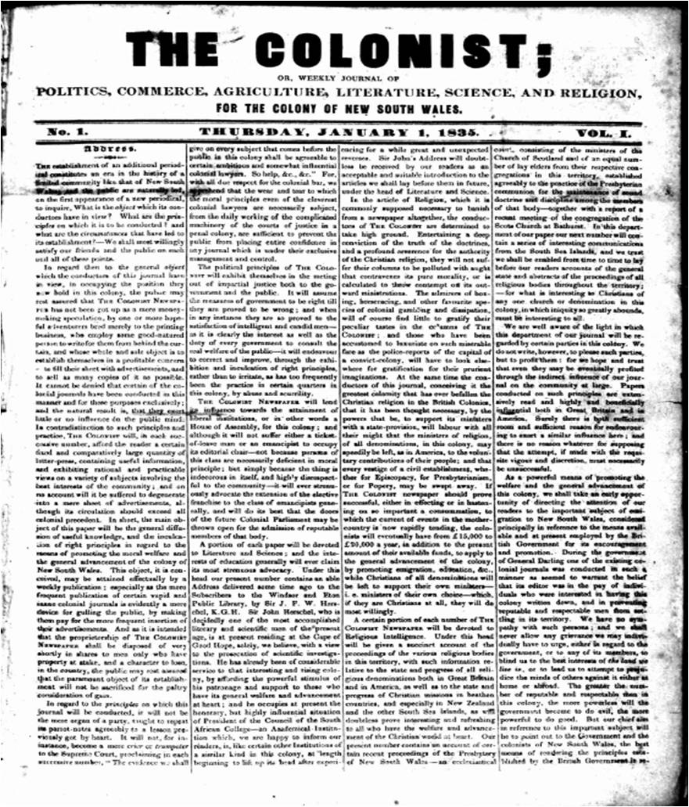

## James Swan <small>(9‑39‑8)</small>

[James Swan](https://adb.anu.edu.au/biography/swan-james-4677) was born in 1811 in Glasgow, Scotland, the son of Daniel Swan and Jennet McLaren. He was apprenticed to the printing trade in Glasgow. In 1831, James married Christina Mackay. In 1837, James emigrated from Glasgow to Sydney with the Rev. Dr John Dunmore Lang and worked on his paper *The Colonialist*. In 1846, the *Moreton Bay Courier* was founded in Brisbane by Sidney Lyons, who persuaded James Swan to come to Brisbane and work on the newspaper. Sidney Lyons had money problems and about 18 months later, James Swan took over the newspaper. In 1859, James sold the *Moreton Bay Courier* to Thomas Blacket Stephens (Brisbane’s second Mayor) who renamed it the *Brisbane Courier*. 

James Swan was an Alderman of the Brisbane Municipal Council from 1872 to 1875 and was Mayor from 1873 to 1875. James's wife Christina died aged 76 years at their home *Burnside* at Windsor on 27 January 1888 after a lingering illness and was buried here. 

James married again on 10 January 1889 to Christina Meikle. James Swan [died](https://trove.nla.gov.au/newspaper/article/167940237) on 26 May 1891 on board *Jelunga* while in the Mediterranean Sea bound for England. He was travelling with his wife for a 12‑month visit. Aged 80 and in poor health when he commenced the trip, many doubted they would see him return. He was buried at sea off Port Said, Egypt but he was memorialised on his first wife's grave. James's second wife Christina died on 3 March 1929 aged 71 years.

{ width="35.05%" } { width="40%" } 

*<small>[Alderman James Swan](https://library-brisbane.ent.sirsidynix.net.au/client/en_AU/BrisbaneImages/search/detailnonmodal/ent:$002f$002fSD_ASSET$002f0$002fSD_ASSET:19691/one?qu=Alderman+James+Swan&rm=BRISBANEIMAGES0%7C%7C%7C1%7C%7C%7C0%7C%7C%7Ctrue&te=ASSET&lm=ALL_ASSETS) — Brisbane City Council.</small>*  
*<small>[The Colonist](https://en.wikipedia.org/wiki/The_Colonist), 1 January 1835 — via Wikipedia. Public Domain.</small>*  
