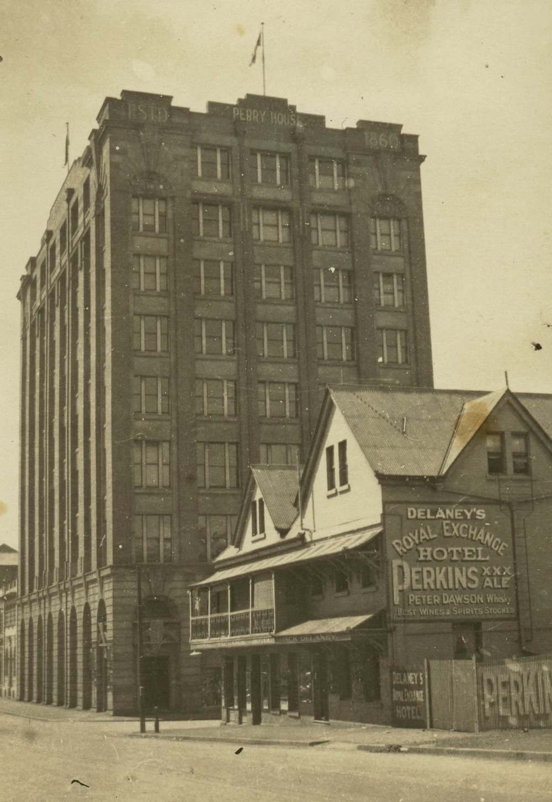

## James Thomas Mooney <small>(7‑45‑10)</small> 

Mooney was born in 1855 in New York, the son of Joseph and Rosa Mooney, natives of Co. Cavan. They arrived in Sydney 1857 on the *FitzJames*. Mooney was a volunteer fireman who was fatally burned in 1877 by an exploding cask of spirits during a fire at Hughes’ grocery store in Queen St. His mother was publican of the Royal Exchange Hotel in Albert Street from where his funeral procession left. His monument was financed by public subscription. His father’s sister was Mary, wife of James Mayne, hide merchant in Tyrone and brother of Patrick Mayne.

{ width="40%" }  

*<small>[Royal Exchange Hotel and Perry House on Elizabeth Street looking north, ca. 1924](http://onesearch.slq.qld.gov.au/permalink/f/1upgmng/slq_alma21271909090002061) — State Library of Queensland.</small>*
