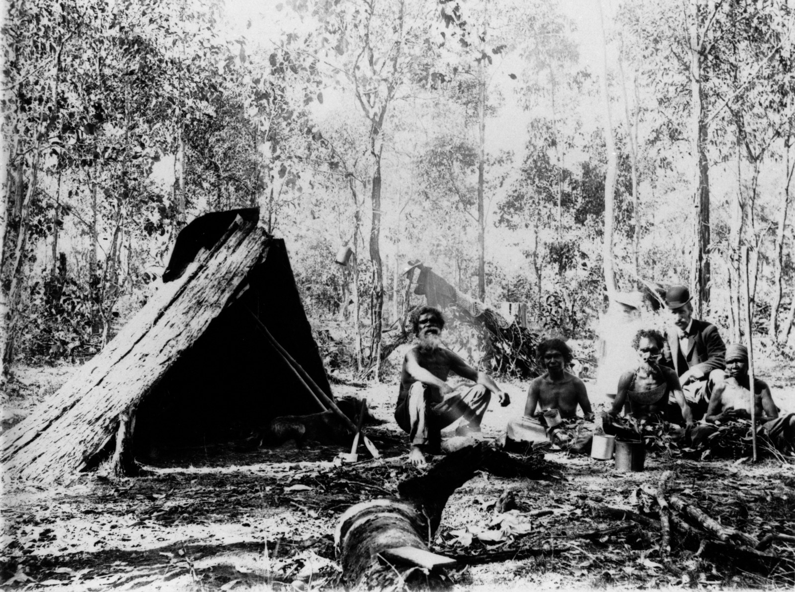
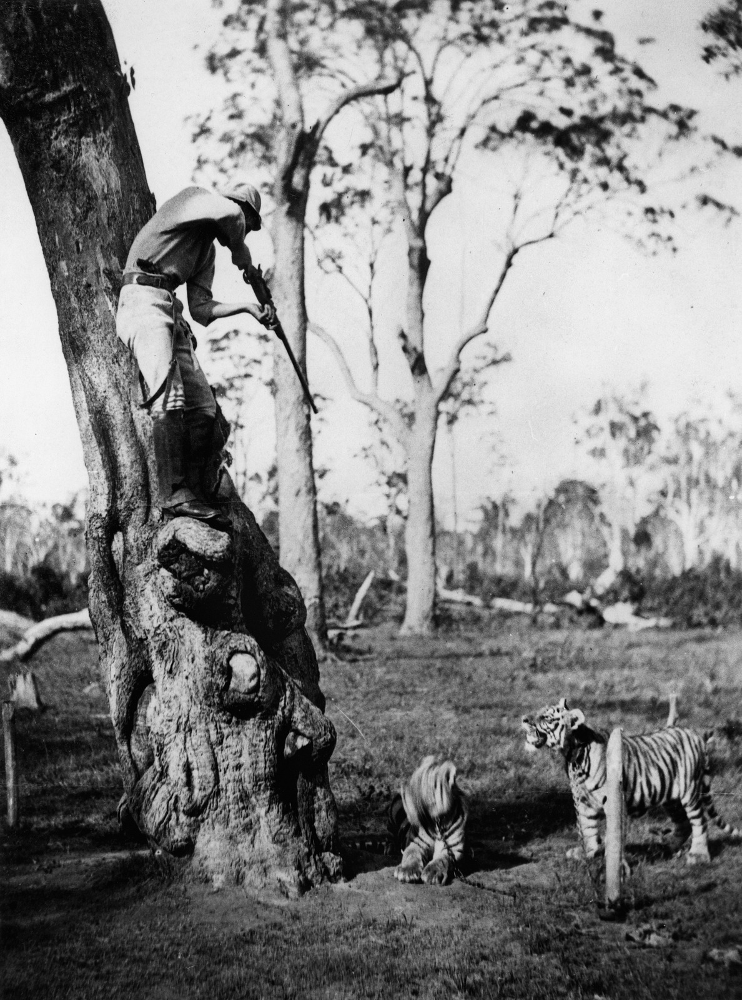
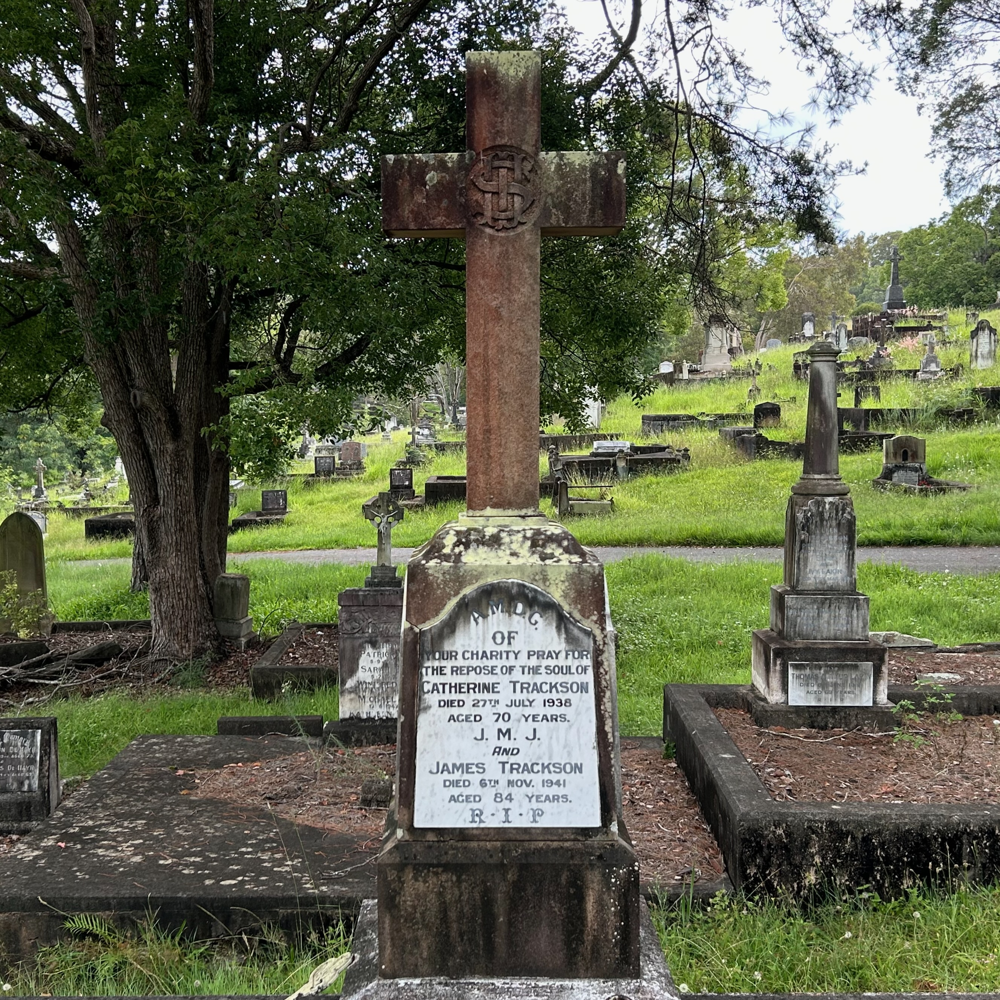

## James Trackson <small>(7‑101‑1/2)</small>

James, entrepreneur and adventurer, was a pioneer of Queensland motoring. In 1902 he imported a Locomobile steam car from the USA which was quoted in many sources as [the first car in Queensland](https://www.slq.qld.gov.au/blog/james-tracksons-tracks-queenslands-first-motorist). He was born in Norwich, England in 1857. He graduated in science from the Polytecnic in London, specialising in electrical science. He arrived in Melbourne in 1883 and was brought to Brisbane in 1884 to assist in establishing a telephone exchange. He was engaged in the installation of the electric light system in Parliament House, Brisbane in 1886. Together with his brother William, he founded the business of Trackson Brothers. [James died in Toowoomba](https://trove.nla.gov.au/newspaper/article/172346702) on 6 November 1941 at the age of 84.

<figure markdown>
  { width="49%" class="full-width" }
  <figcaption markdown>[Mr & Mrs Trackson in the steam Locomobile.](https://onesearch.slq.qld.gov.au/permalink/61SLQ_INST/1dejkfd/alma99183853678302061) — State Library of Queensland.</figcaption>
</figure>

<figure markdown>
  { width="49%" class="full-width" }
  <figcaption markdown>[James and Marie Trackson with others near the Alderley Train Station, 1900.](https://onesearch.slq.qld.gov.au/permalink/61SLQ_INST/1dejkfd/alma99183784908002061) — State Library of Queensland.</figcaption>
</figure>

<figure markdown>
  { width="49%" class="full-width" }
  <figcaption markdown>[James Trackson aiming a gun at tigers at Toombul, 1884.](https://onesearch.slq.qld.gov.au/permalink/61SLQ_INST/dls06p/alma99183784907702061) — State Library of Queensland.</figcaption>
</figure>

<figure markdown>
  { width="49%" class="full-width" }
  <figcaption markdown>James Trackson's headstone in Toowong Cemetery.</figcaption>
</figure>
