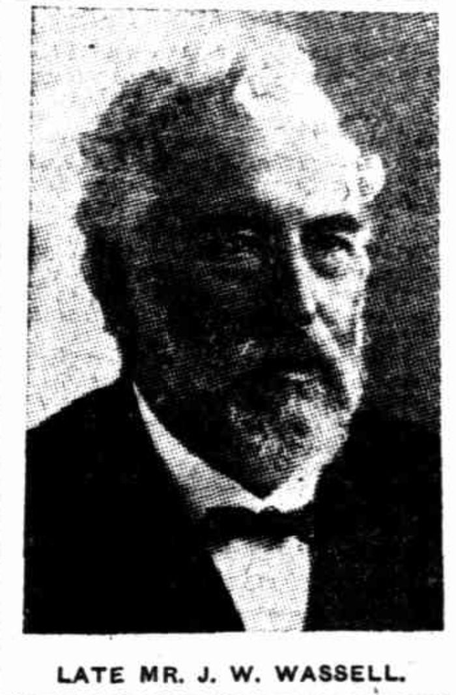

## James William Wassell <small>(13‑65‑10)</small>

James William Wassell was the son of Joseph Wassell and Jane (née Chandler). His father was one of the inner pilots of Portsmouth Harbour. James was born on 10 February 1841 at Fareham, just outside of Portsmouth.

James arrived in Brisbane on 29 January 1864 on the ship *Light of Age* and  immediately joined the Water Police in Brisbane. For many years he was in charge of the prison hulk [*Proserpine*](https://www.findandconnect.gov.au/ref/qld/biogs/QE00529b.htm) and the boys Reformatory at Lytton. He assisted in founding the [Boy's Home at Enoggera](https://www.findandconnect.gov.au/guide/qld/QE00069), the Hospital for Sick Children, the Lady Lamington Hospital, and the Institute of Social Service. Wassell was also a staunch supporter of the Creche and Kindergarten movements, and a Trustee of Toowong Cemetery.

James died at his home in Teneriffe on 12 January 1926 and is buried with his wife Rebecca who died in 1898 and their infant son, Arthur who died in December 1875.  Another of their sons, James Lake Wassell, a well-known Brisbane barrister was buried with them in 1938.

<figure markdown>
  { width="30%" }
  <figcaption markdown>[J. W. Wassell](https://trove.nla.gov.au/newspaper/article/181447533) - The Week, 15 January 1926</figcaption>
</figure>

<!--
Julie Percy ship - https://onesearch.slq.qld.gov.au/permalink/61SLQ_INST/tqqf2h/alma99183506378402061

-->
