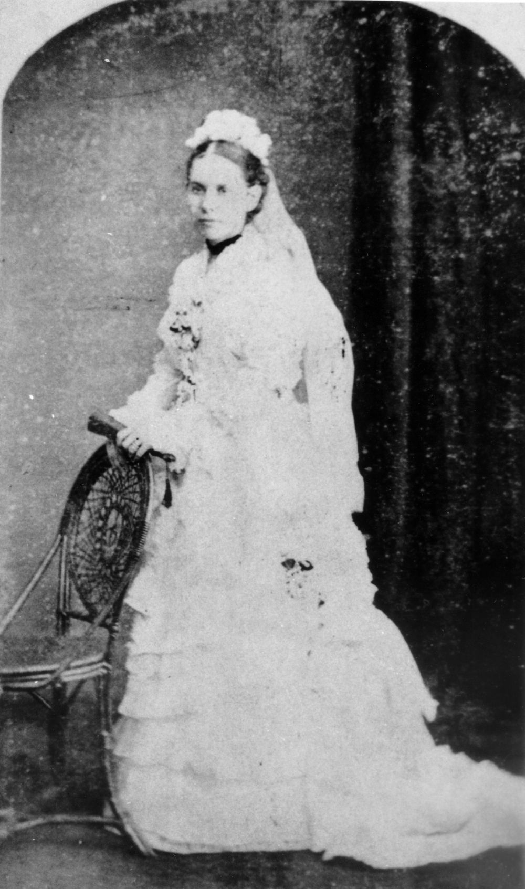

## Jessie Philp <small>(14‑23‑10)</small>

Jessie Bannister, the eldest daughter of James and Isabella Campbell, died on 21 November 1890 at Baroona. She was the 34‑year‑old wife of politician Robert Philp (MLA for Townsville) and mother of seven surviving children. Jessie and Robert married at Ballymore in February 1878 before setting sail for Townsville, where most of her nine children were born. Her youngest child was just two weeks old when Jessie, weakened from recent childbirth, succumbed to the scarlet fever for which she was nursing two of her older children.^4^

{ width="40%" }

*<small>[Portrait of Jessie Bannister Philp, ca. 1878](http://onesearch.slq.qld.gov.au/permalink/f/1upgmng/slq_alma21220205850002061) - State Library of Queensland </small>*
