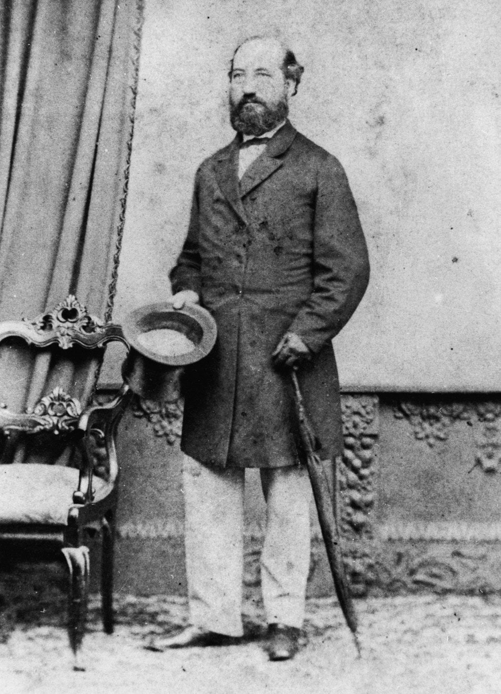

John Heussler was born on 15 June 1820 at Bockenheim, Germany (near Frankfurt‑am‑Main) and arrived in Queensland in 1854. His background was as a wine merchant in London and Holland. He married Sophia Esther, daughter of John and Christian Westgarth of Edinburgh. She came to Queensland from Victoria with her mother, also buried here, and sister, shortly after their arrival in Australia. John and Sophia Heussler married in Brisbane on 10 March 1859. John Christian died on 26 October 1907 and his widow died on 5 June 1914. While *“religion was not to play a big role in his life”*, he was buried according to Lutheran rites from Nazareth Church, Hawthorne Street, Woolloongabba. 

He played a large role in immigration, particularly encouraging an estimated two thousand German Lutherans to come to Queensland. He built Fernberg, the current home of the Governor of Queensland but lost it to creditors in 1879. He was appointed a member of the Legislative Council in 1866, holding the position until his death. He became Honorary Consul for the German Empire and also for the Netherlands. In 1896 he opened the new school of the Nazareth Lutheran Church and presented a gift of 400 marks from the German Kaiser.

{ width="40%" } { width="41.55%" }

*<small>[Johann Christian Heussler ( b.1820)](https://onesearch.slq.qld.gov.au/permalink/61SLQ_INST/1dejkfd/alma99183513998802061) — State Library of Queensland</small>*

*<small>[Sophia Esther Heussler](https://onesearch.slq.qld.gov.au/permalink/61SLQ_INST/tqqf2h/alma99183507851502061) — State Library of Queensland</small>*
