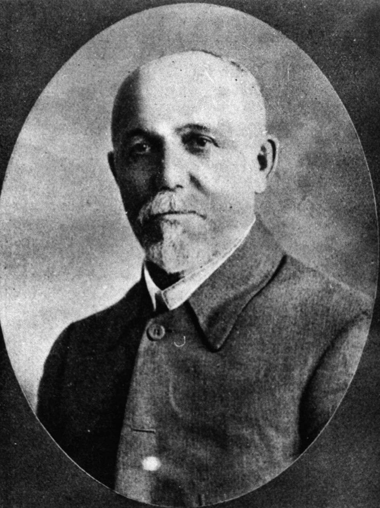

## Senator John Adamson <small>(18‑111‑1)</small>

John Adamson, Primitive Methodist minister and later politician, was born on 18 February 1857 at Tudhoe, County Durham, England, the son of Robert Adamson, a shoemaker, and his wife, Dorothy, née English. He came to Queensland with his young wife, Caroline (née Jones) in 1884. In 1915 he became Secretary for Railways in the Ryan Government. He was elected to the Senate in 1919. He died at Hendra railway station on 2 May 1922.

{ width="40%" }  

*<small>[John Adamson](http://onesearch.slq.qld.gov.au/permalink/f/1upgmng/slq_alma21218306100002061), 1915 - State Library of Queensland </small>* 
