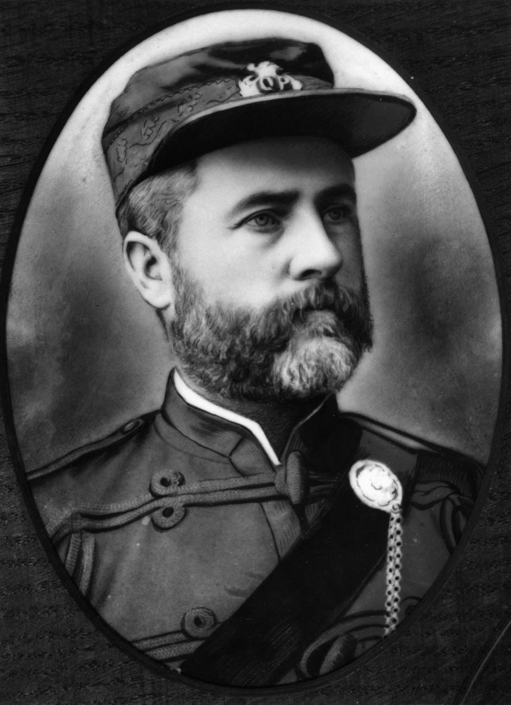
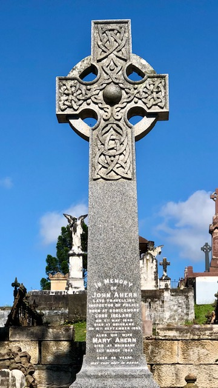

## John Ahern <small>(7‑51‑4)</small>  

Ahern was born at Donickmore, County Cork, Ireland in 1840, a son of Denis Ahern and Honoria O’Mahoney. He was a farmer prior to joining the Queensland Police Force in September 1864. Ahern was sent to Springsure in October and promoted to Senior Constable/Acting Sergeant in July 1868. He became Inspector of Slaughterhouses in the Mitchell district in February 1870 and received the substantial reward of £15 in September 1872 for *‘energetic perseverance in suppressing cattle‑stealers in the Barcoo and Walgett districts’*. 

Ahern was promoted to Senior Sergeant in January 1874 and Sub‑Inspector 2^nd^ class in 1877. He served at Blackall in 1880 where he became Sub‑Inspector 1^st^ class. Ahern married in 1883 Mary, sister of Andrew Joseph Thynne from Clare. By 1890, he had been promoted to Inspector 1^st^ class in charge of all brands throughout the colony. Ahern was a most respected and energetic policeman. [John Ahern died in 1893](https://trove.nla.gov.au/newspaper/article/77218982/7608478). 

<!-- TODO merge with shearer's strike entry 
- https://trove.nla.gov.au/newspaper/article/79708042?searchTerm=Ahern#
-->

{ width="40%" } { width="31%" } 

*<small>[John Ahern](http://onesearch.slq.qld.gov.au/permalink/f/1upgmng/slq_alma21218566240002061) -  State Library of Queensland</small>*
