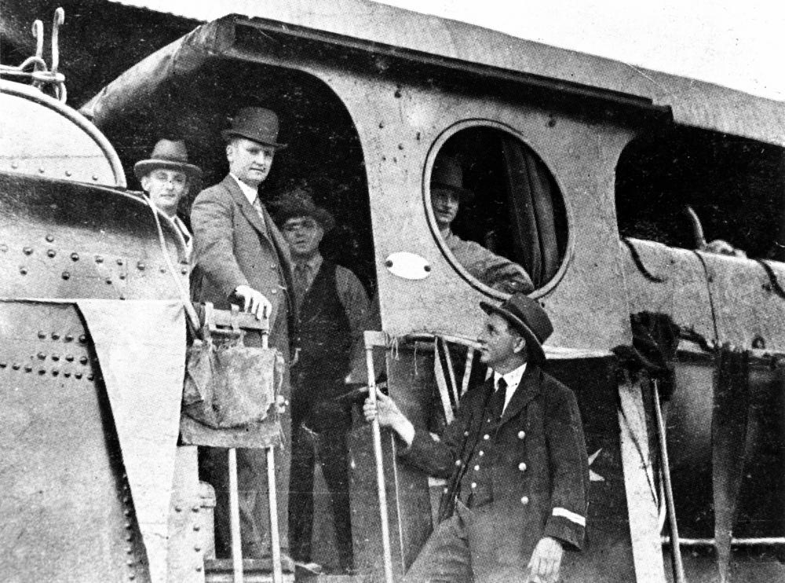

## John and Ellen Forde <small>(15‑19‑27/28)</small>

Irish immigrants, John and Ellen Forde were the parents of [Francis Michael Forde](https://adb.anu.edu.au/biography/forde-francis-michael-frank-12504) better known as Frank Forde, the 15^th^ Prime Minister of Australia.

{ width="70%" }

*<small>[Frank Forde pilots a train into Brisbane, 1930](http://onesearch.slq.qld.gov.au/permalink/f/1upgmng/slq_digitool42043) - State Library of Queensland.</small>*
