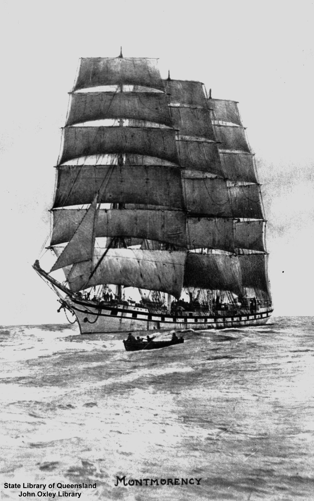

## John and Mary Ann Ogle <small>(1‑113‑3/4)</small>

John, a son of John Ogle and Isabella (née Swan), was born in Northumberland, England ca. 1824. Mary Ann Scott, a daughter of Robert Scott and Mary (née Frater), was born ca. 1823.

Mary Ann and John, with their three daughters, arrived in Brisbane aboard the *Montmorency* on 16 October 1860.

The Ogles were early settlers at Pullenvale, where John farmed. Part of their property (portions 222 & 229, county of Stanley, parish of Moggill, consisting of 173 acres) included the site of the [Pullenvale Hall](https://g.page/thepullenvalehall) at the corner of Grandview and Pullenvale Roads, which became known as Ogle's Corner.

John died on the 26 October 1890. Mary Ann died on the 24 August 1907.

{ width="40%" }  

*<small>[Montmorency (ship)](http://onesearch.slq.qld.gov.au/permalink/f/1upgmng/slq_alma21220157310002061) — State Library of Queensland.</small>*
