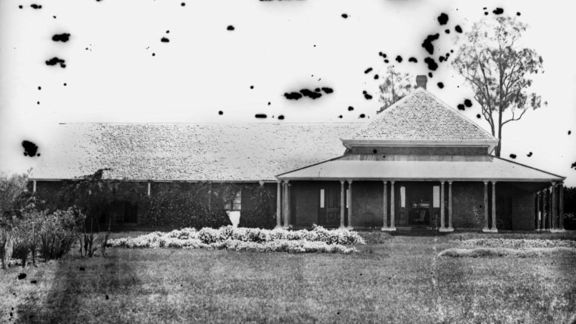

## John Arthur Macartney <small>(5‑62‑16)</small>

John Arthur Macartney (1834-1917) was the eldest son of the Very Rev Hussey Burgh Macartney, the First Dean of Melbourne and his wife Jane (née Hardman). He studied law but resigned after 18 months to take up his first station property in Victoria. Over time he owned 25 stations and other properties in Qld and NT. He died at his home, [Ormiston House](https://ormistonhouse.org.au/the-house/) near Cleveland.

 

*<small>[Captain Louis Hope's residence, Ormiston House, Cleveland district, ca.1871](http://onesearch.slq.qld.gov.au/permalink/f/1upgmng/slq_alma21249909850002061) — State Library of Queensland. Cropped. </small>*
