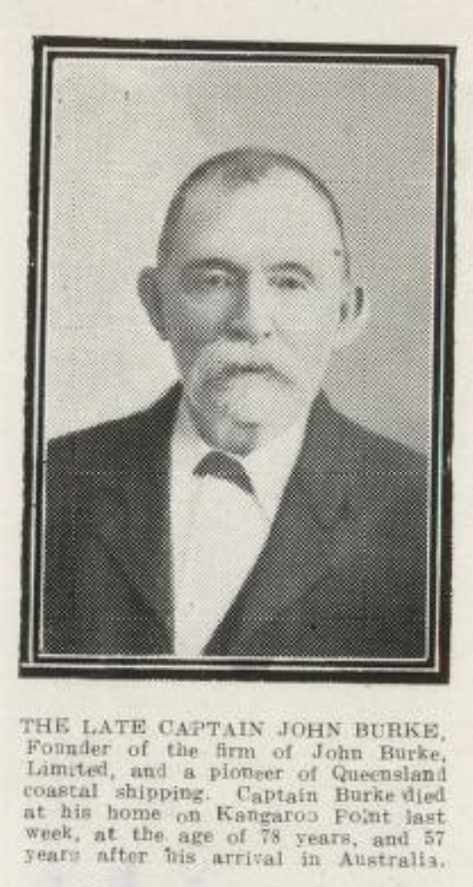
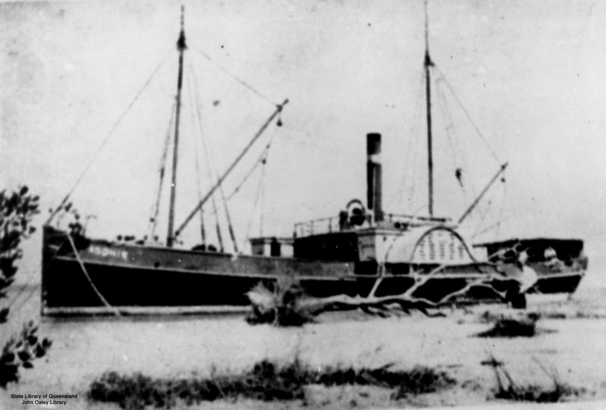

## Captain John Burke <small>(7‑19‑1)</small>

[John](https://adb.anu.edu.au/biography/burke-john-5429) was born at Kinsale, Cork the son of fisherman Denis Burke and his wife Ellen. He was a seaman on ships to the USA until the outbreak of the Civil War when he returned to Ireland and signed on with the crew of the *Erin Go Bragh* which arrived in Brisbane in August 1862. He deserted and worked as a pilot for the Australian Steam Navigation Company sailing the *Queensland* and the *Telegraph*. He married Alicia Swords from the *Erin Go Bragh*, and settled on the Logan River. 

He held a Masters Licence and worked on bay and river ships commanding the *Fanny* on the Albert and Logan rivers. He established the John Burke Shipping Line in 1887 and bought the *Louisa* and traded from Ipswich to Logan and later on Moreton Bay. 

By his death in 1919, he had nineteen ships, although he had retired in 1915 staying only as the Director. Captain Burke Park at Kangaroo Point is named in honour of him. His company was sold by his grandson in 1968. 

{ width="25.25%" }  { width="70%" } 

*<small>[Page 27 of the Queenslander Pictorial, supplement to The Queenslander, 14 June, 1919.](http://onesearch.slq.qld.gov.au/permalink/f/1upgmng/slq_digitool1045834) - State Library of Queensland </small>*   
*<small>The [Adonis (ship)](http://onesearch.slq.qld.gov.au/permalink/f/1upgmng/slq_alma21250468940002061) was built in 1883 and was owned by Dath Henderson, Brisbane, who also owned a sawmill on the Noosa River at Tewantin. The Adonis was later sold to John Burke in Brisbane, Queensland. — State Library of Queensland.</small>*
