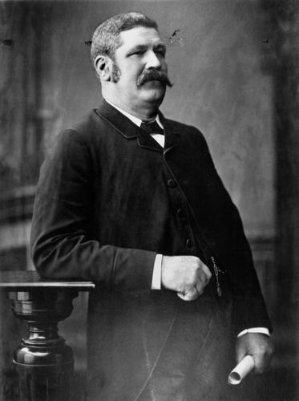

## John Donaldson MLA <small>(12‑47‑13)</small>

{ width="40%" } 

*<small>[John Donaldson, Queensland Minister for Public Instruction, 1889](http://onesearch.slq.qld.gov.au/permalink/f/1upgmng/slq_alma21218181910002061) - State Library of Queensland </small>* 

Victorian‑born Donaldson became a pastoralist in Queensland. He was a manager and director of a mortgage agency and a bank. He was also President of the Queensland branch of the Australian Natives’ Association. Donaldson was a member of the Legislative Assembly from 1883 to 1893 and served as Post Master General and Colonial Treasurer. At the convention he sought free‑trade colonies conservative constitution.
