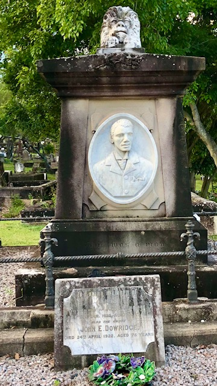

## John (Jack) Dowridge <small>(5‑28‑14)</small>

Mr Jack Dowridge, one of the pioneers of boxing in Brisbane, and familiarly known as the "Black Diamond," He was born in Barbados Island in 1848, but at the age of 12 years he drifted to London. It was here that he first picked up the rudiments of boxing. The arena attracted him, and he secured employment with Nat Langham, the retired champion of England, who was then keeping the Mitre Tavern, in St. Martin's Lane. In the year 1862 this tavern was a rendezvous of all the great fistic exponents of that time, such as Joe Cross, Boie Brotties, Jim Mace, Tom King, Coburn, Bob Travers, Ned Donnelly, Professor Johns, Bat Mullins, Heenan, Jerry and Billy Ox. It was here that Jack Dowridge made the acquaintance of Tom Sayers, whom Langham first defeated, and in whose favour he subsequently retired. "Jack" became one of Langham's best pupils, and developed the straight style of the old school of boxing. 

In 1872 Dowridge came to Australia. He secured premises in Queen Street, known as the "Hole in the Wall," which had just been vacated by Larry Foley. He opened a tobacconist saloon and a small select boxing school, but he did not stay long. He returned to England, but the climate soon drove him back to Queensland. He secured premises opposite the Normal School, and after a few years he opened a restaurant and taught boxing at Petrie's Bight, where Quinlan Gray's warehouse later stood. He later removed to Roma Street and then to the corner of Turbot and George streets. His school was the resort of all the young sporting men of the day. Dowridge was one of the best promoters of that time, and under his care were Peter Jackson, Jack M'Gowan and innumerable others.

When Peter Jackson died a public subscription was the means of providing the stone which was placed at the head of the grave, but it was [Jack Dowridge who provided for the purchase](https://trove.nla.gov.au/newspaper/article/71056665) of the land at Toowong cemetery and to pay the funeral expenses.

{ width="40%" }
