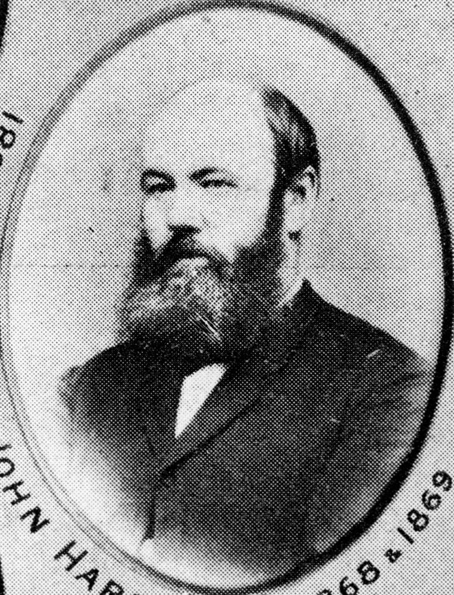

## John Hardgrave <small>(14‑22‑2/3)</small>

John Hardgrave, a local politician and Mayor of Brisbane, was born in Wicklow, Ireland, in 1826. He arrived in Sydney in 1843 and moved to Brisbane in 1848. In 1860 he purchased 6 acres (2.4 hectares) of land in the Brisbane suburb of West End. [Hardgrave Road is named after him](https://trove.nla.gov.au/newspaper/article/23152541). 

He was in the boot trade to 1862 and was involved in local government from 1867 to 1890. He was Mayor of Brisbane in 1868 and 1870, first chairman of the Woolloongabba Divisional Board, Alderman for South Brisbane from 1888 to 1890, and chairman of the Waterworks Board from 1893. He died in Brisbane on 8 November 1906 and was interred in the family grave.

{ width="40%" }  

*<small>[John Hardgrave, early resident and mayor of Brisbane, 1868-1869](http://onesearch.slq.qld.gov.au/permalink/f/1upgmng/slq_digitool111232) — State Library of Queensland.</small>*
