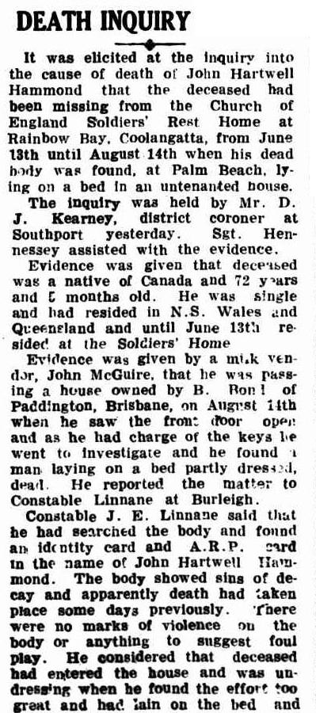
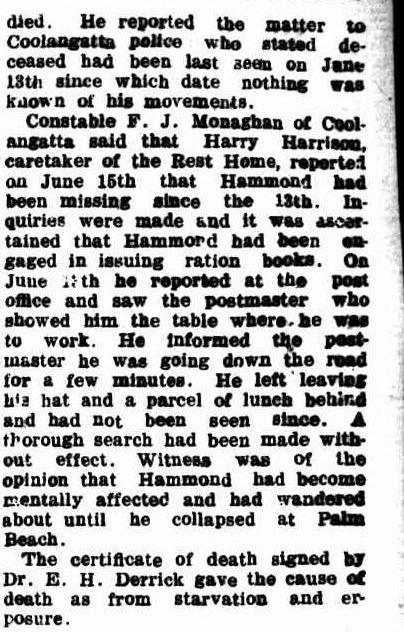

## John Hartwell Hammond <small>[(10‑83‑4)](https://brisbane.discovereverafter.com/profile/31865694 "Go to Memorial Information" )</small>

A plumber and a seaman before the war, John was born in Canada, enlisted in 1915 at the age of 44 and served in the 6^th^ field company engineers. At the time he listed as next of kin a step sister in China and his father was deceased. 

WW1 details:

- 30/3/17 Admitted to hospital dental and mumps
- 19/5/18 Wounded in action - gun shot wound arms and left leg
- 18/9/18 to Furlough
- 15/2/19 Discharged with a disability due to multiple gun shot wounds

Was wounded in 22 places with fracture of left fibular and right hallux. Counter drains in both left and right feet and latn. Sequestrectomy (removal of dead portions of bone) in left foot. All wounds healed but feet tender to walk on and fore and middle finger of left hand are very weak and anaesthetic.

Lieutenant Colonel John Hammond received the distinguished conduct medal. He showed conspicuous gallantry.

==TROVE ARTICLES BELOW==

Sadly, John Died of starvation and exposure

{ width="30%" class="full-width" } { width="30%" class="full-width" } 

*<small>DEATH INQUIRY (1942, November 18). South Coast Bulletin (Southport, Qld. : 1929 - 1954), p. 3. Retrieved March 7, 2025, from [http://nla.gov.au/nla.news-article188312545](http://nla.gov.au/nla.news-article188312545)</small>*