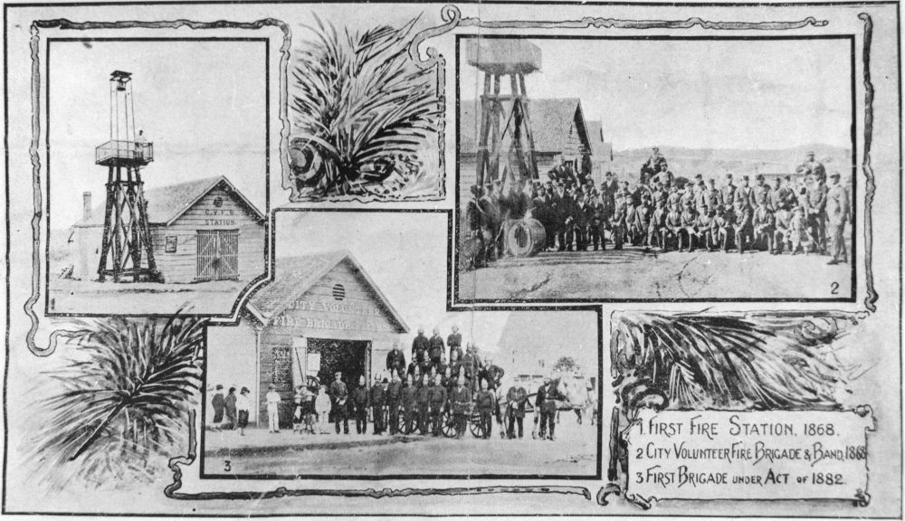

## John Lamacraft Richards <small>(5‑24‑13/14)</small>

John Lamacraft Richards was a native of Devon in England. He arrived in Brisbane on the ship *Golden City* on 6 January 1865. He was a member of the City Volunteer Fire Brigade from 1876 to 1882 and of the Brisbane Fire Brigade from 1882 to 1889. He was a foundation member of the Progressive Lodge (Oddfellows) and also of the Brisbane Past Grand's Lodge.

{ width="100%" }

*<small>[First Brisbane Fire Stations, 1868-1882](http://onesearch.slq.qld.gov.au/permalink/f/1upgmng/slq_alma21253913780002061), presented on his retirement from his position as Head Teacher at the Milton State School, Brisbane from 1888 to 1916 - State Library of Queensland. </small>*
