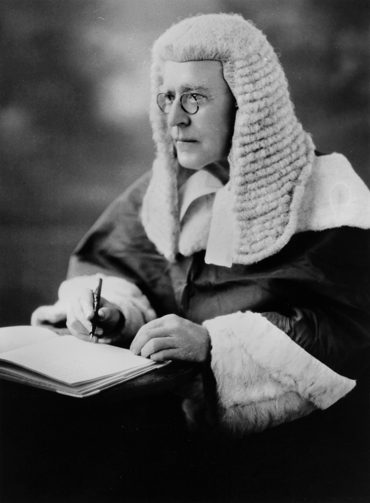

## The Honourable John Laskey Woolcock BA <small>[(11‑65‑2)](https://brisbane.discovereverafter.com/profile/31860141 "Go to Memorial Information" )</small>

Born Cornwall, England on 7 November 1861 to Rev. William Woolcock and Elizabeth White. Woolcock commenced his legal studies while reading in Griffith's chambers and was admitted as a barrister of Queensland Supreme Court in 1887. He was appointed a Judge of the Queensland Supreme Court in 1927 and died in office less than two years later on 18 January 1929.

<figure markdown>
  { width=40% class="full-width" }
  <figcaption markdown>[Judge John Laskey Woolcock](https://onesearch.slq.qld.gov.au/permalink/61SLQ_INST/dls06p/alma99183788010802061) — State Library of Queensland.</figcaption>
</figure>