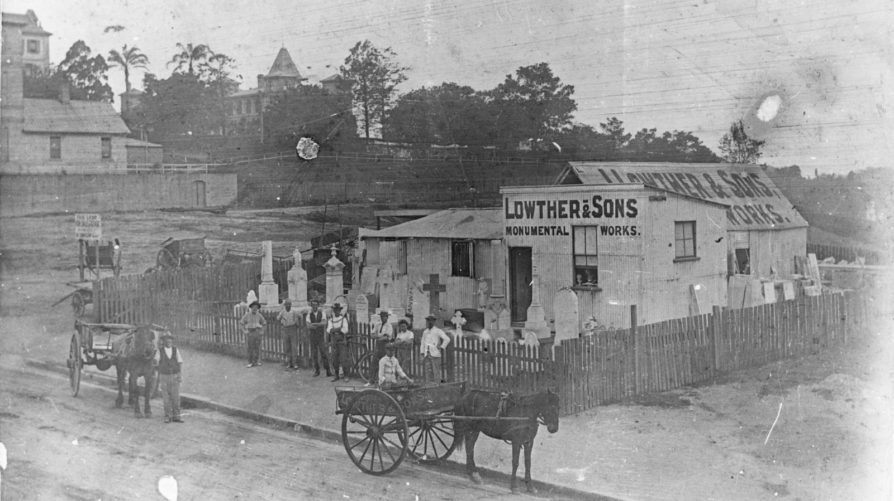

## John Lowther <small>[(12‑5‑3/4)](https://brisbane.discovereverafter.com/profile/31837211 "Go to Memorial Information" )</small>

John Lowther was born in Hull, Yorkshire in 1852. He married Christine (née Hillen) in 1876 July and they sailed aboard the *Stirlingshire* from Glasgow to Townsville, arriving on 7 November 1882.

John Lowther ran the firm of "J Lowther" (1889-1902) and then "Lowther & Sons" on Ann Street, Brisbane. John and his wife lived at “Hunbernia”, Free street, Kelvin Grove, and had five children, Phillip, Ernest, Charles, Arthur and Lottie. John Lowther died 4 April 1918 aged 66.

<!--
TODO
<figure markdown>
  { width="30%" }
  <figcaption markdown>Insert image of J. Lowther' carving on tbd</figcaption>
</figure>
-->

The business continued after John's death, with his eldest son, Phillip J. Lowther, operating the firm "[Phillip Lowther and Son](https://trove.nla.gov.au/newspaper/article/39008541?searchTerm=monumental)" Monumental and Building Masons at 108 Lutwyche Road. Notable works include:

- the monument to [William Henry Sowray](../research/william-henry-sowray.md) in Toowong Cemetery
- the [Sandgate Cenotaph](https://trove.nla.gov.au/newspaper/article/180045354?searchTerm=Bowser%20%20MONUMENTAL%20MASONS)
- [Cross of Sacrifice at Lutwyche Cemetery](https://onesearch.slq.qld.gov.au/permalink/61SLQ_INST/dls06p/alma99184003729202061)
- [Australian-American Memorial](https://www.qldwarmemorials.com.au/memorial?id=1405) at Newstead Park, Newstead

<!--
TODO
<figure markdown>
  { width="30%" }
  <figcaption markdown>Insert image of P.J. Lowther & Sons' mark on James Hetch Bulter (11-40-8)</figcaption>
</figure>
-->
  
Phillip's son, [Leslie John Lowther](https://trove.nla.gov.au/newspaper/article/50225005), was the managing director of P. J. Lowther and Son, Pty., Ltd., masonry contractors, Bowen Bridge Road. Leslie is buried in Toowong Cemetery (8‑71‑26/27).

<figure markdown>
  { width="70%" class="full-width" }
  <figcaption markdown>[Firm of Lowther & Sons on Ann Street, ca. 1907](https://onesearch.slq.qld.gov.au/permalink/61SLQ_INST/dls06p/alma99183513705502061). The business of Lowther and Sons, monumental headstones was situated on Ann Street, between Boundary Street and Antrim Street — State Library of Queensland. Cropped.</figcaption>
</figure>

<!--
??? warning "Research"

    - [Daughter Nellie died September 1914](https://trove.nla.gov.au/newspaper/article/176396437?searchTerm=%22John%20Lowther%22). Funeral left from their home in Free street, Kelvin Grove.
    - [Charles](https://trove.nla.gov.au/newspaper/article/22211615?searchTerm=%22John%20Lowther%22)
    -  https://trove.nla.gov.au/newspaper/article/20357396?searchTerm=%22John%20Lowther%22 
    -  [buried in Toowong Cemetery](https://trove.nla.gov.au/newspaper/article/176070446?searchTerm=%22John%20Lowther%22)
-->
