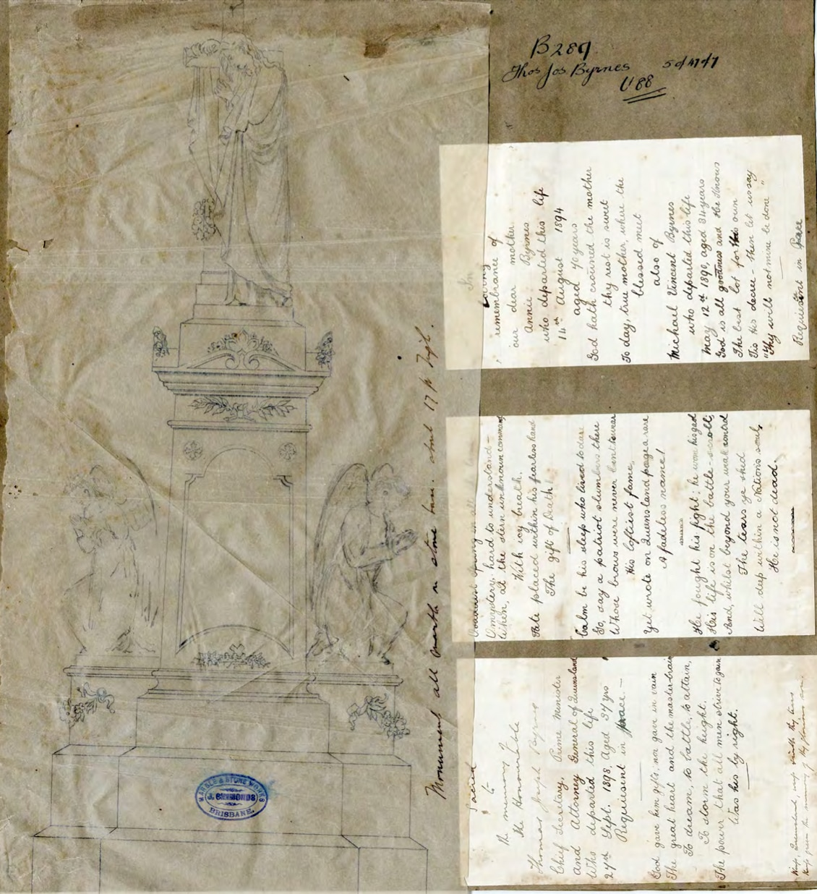
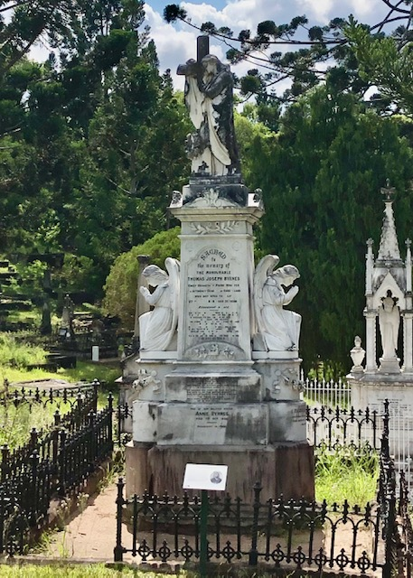
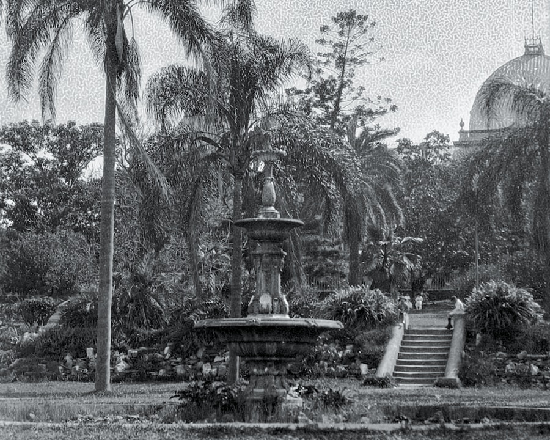
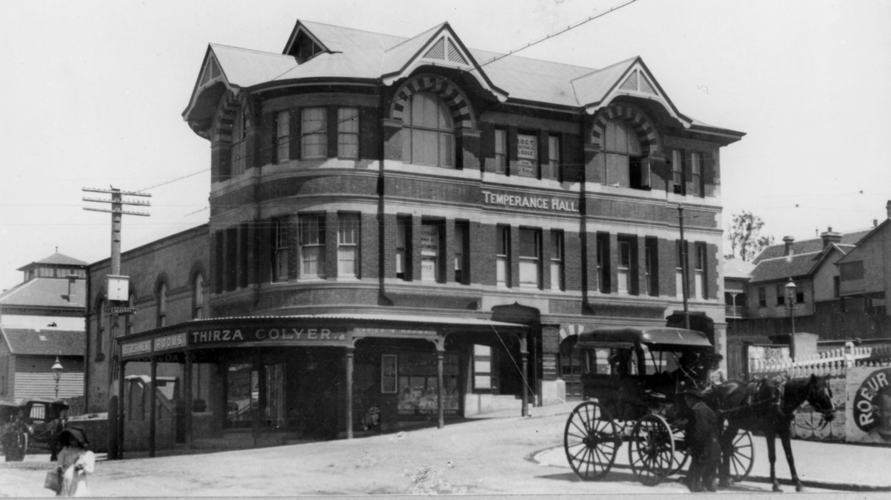
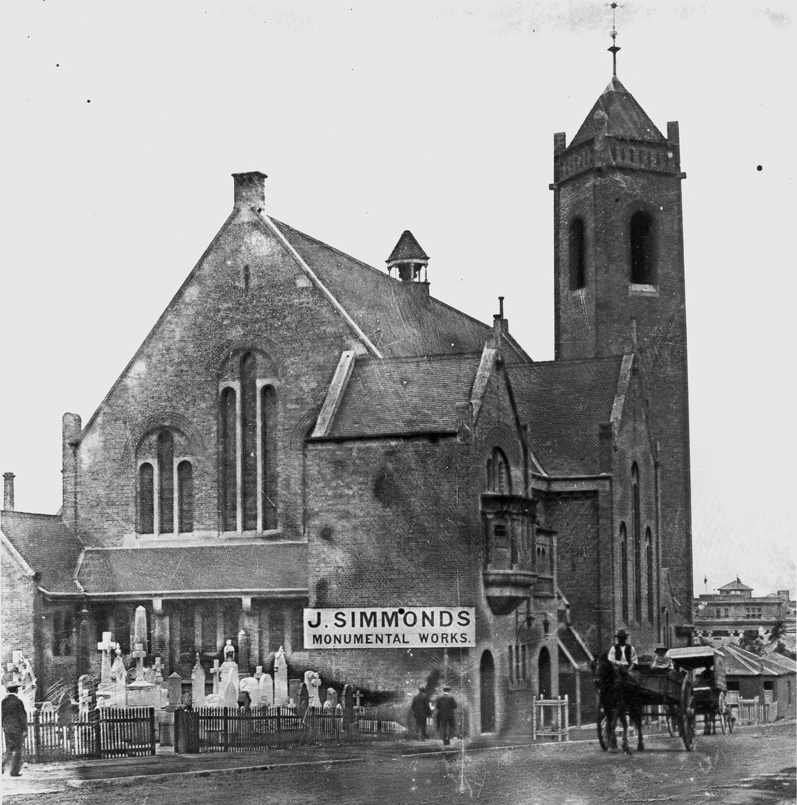

## John Simmonds <small>(4‑3‑27)</small>

<!-- ca. 1829 - 23-01-1889 -->

John Simmonds was born in Blandford, Dorset around 1828, the eldest son of John Simmonds, builder and stonemason and Ann (née Pond). John sailed with his family from London aboard the *Lady Eveline*, arriving in Port Phillip in November 1852. Mary Jemima Coombs married John at Pelham Street, Melbourne on 17 December 1859. They had 10 children born in Victoria. John took over the family’s stonemason business on the death of his father in 1860.

John Simmonds founded a monumental masory business Brisbane in around 1880. His company created the beautiful momument to T.J. Byrnes and has family in Toowong Cemetery (7-47-5).

{ width=45% class="full-width" }  { width=35.1% class="full-width" }

<small>*[Monumental plans and headstone description - Thomas Joseph, Annie and Michael Vincent Byrnes](https://www.archivessearch.qld.gov.au/items/ITM1675894) ca. 1898 — Queensland State Archives, Item ID ITM1675894. Cropped and darkened.*</small> 

<!--  
<small>*Thomas Joseph, Annie and Michael Vincent Byrnes monument, 2023*</small> 
-->

<!--
He created a fountain that was placed in the lawns immediately in front of the Queensland Houses of Parliament. In [*The Queenslander*, 9 December 1882](https://trove.nla.gov.au/newspaper/article/19788278?searchTerm=Simmonds%20monumental%20mason) an article about the Brisbane Botanic Gardens, reported:

>A very pleasing and attractive addition has been made recently in the shape of a fountain, chaste and neat in its design rather than elaborate, but which, in the opinion of many, will not detract in the least from its usefulness or general effect. This addition is placed conspicuously on one of the lawns immediately in front of the Houses of Parliament, and when connected with the Enoggera main, and put into play, will have a very pleasing and salutary effect. This work of art — for such it may be termed — is the production of Mr. J. Simmonds, monumental mason and sculptor, of Adelaide street.

[The fountain was removed in 1958](https://www.jstor.org/stable/26391593) when the gardens were extensively redeveloped.

The business was founded in Melbourne in 1852 by John Simmonds Snr (1793-1860), then, after his death, passed on to his son John Simmonds Jnr (1828-1889). 

https://brightoncemetery.com/john-simmonds-1793-1860/

https://library-brisbane.ent.sirsidynix.net.au/client/en_AU/search/asset/4675/0
https://library-brisbane.ent.sirsidynix.net.au/client/en_AU/search/asset/4679/0
https://library-brisbane.ent.sirsidynix.net.au/client/en_AU/search/asset/4625/0 - City Botanic Gardens - Fountain and Garden bed c1880 - USE THIS ONE

<figure markdown>
  { width=70% class="full-width" }
  <figcaption markdown>[Fountain and stairs in the Botanic Gardens with Parliament House in the background, Brisbane, 1920](https://onesearch.slq.qld.gov.au/permalink/61SLQ_INST/dls06p/alma99184033059802061) — State Library of Queensland. Cropped and rotated.</figcaption>
</figure>

In 1888, John created [a marble drinking fountain for Women's Christian Temperance Union](https://trove.nla.gov.au/newspaper/article/176707482) that was erected on the corner of Ann and Edward streets just outside the Temperance Hall.

<figure markdown>
  { width=70% class="full-width" }
  <figcaption markdown>[Temperance Hall and the Colyer Refreshment Rooms on the corner of Ann Street and Edward Streets](https://onesearch.slq.qld.gov.au/permalink/61SLQ_INST/dls06p/alma99183505877102061) ca. 1912. The Temperance Hall in Brisbane was built in 1900. — State Library of Queensland.</figcaption>
</figure>

<figure markdown>
  { width=70% class="full-width" }
  <figcaption markdown>[View of Brisbane city's central business district, ca. 1895](https://onesearch.slq.qld.gov.au/permalink/61SLQ_INST/dls06p/alma99183787998202061) — State Library of Queensland.</figcaption>
</figure>
-->

John Simmonds took on his son, John Howard Simmonds (1862-1955), <!-- born in Calton Vic. --> as an apprentice stonemason in 1880. He ran the business after his [Father's death in 1889](https://www.familyhistory.bdm.qld.gov.au/details/b26ee2454ca983d88a44de85d949647c8e514f213f0884dc188c50bb4bdc7c2c) until he retired in 1920. 

<!--
TODO
<figure markdown>
  { width="30%" }
  <figcaption markdown>Insert image of  John Simmonds' carving on Arthur Lowe (11‑15‑16/17)</figcaption>
</figure>
-->

J.H. Simmonds made a point of photographing the tombstones he worked on. He introduced photography to his wife, [Rose Simmonds](https://adb.anu.edu.au/biography/simmonds-rose-11691/text20893), who studied art with Godfrey Rivers at the Brisbane Technical College. [A collection of Rose Simmonds' work](https://blog.qagoma.qld.gov.au/rose-simmonds-a-nostalgia-for-queenslands-pastoral-past/) is held by the Queensland Art Gallery. [J.H. Simmonds was also a Naturalist](https://www.eoas.info/biogs/P006858b.htm) who collected fossils and botanical specimens that are now held in the Queensland Museum and Queensland Herbarium.

<figure markdown>
  { width="40%' class="full-width" }
  <figcaption markdown>[St Andrew's Presbyterian Church on Ann Street, Brisbane, with stonemason next door, ca. 1915](https://onesearch.slq.qld.gov.au/permalink/61SLQ_INST/tqqf2h/alma99183505905002061) - State Library of Queensland. In March 1896 [John Simmonds moved his business to Ann-street](https://trove.nla.gov.au/newspaper/article/20446535?searchTerm=Simmonds%20monumental%20mason), near Creek-Street and the Central Station.</figcaption>
</figure>

<!--

??? warning "Research"

    - https://trove.nla.gov.au/newspaper/article/70862389?searchTerm=headstones - Ad 26 Nov 1892 - Roma Street
    - https://trove.nla.gov.au/newspaper/article/20767681 - DISPLAY AD 19 December 1896 - ANN-STREET, near Creek-street
    - John Howard Simmonds 15 July 1862 - 11 June 1955
        - A [Naturalist and Stonemason](https://www.eoas.info/biogs/P006858b.htm)
        - Son of J. Simmonds (Dad was 33 when born)
        - 1880 Apprenticed to J. Simmonds, Stonemason
        - 1889 - 1920 - Owner, J. Simmonds, Stonemason =(took over after father's death)
        - https://trove.nla.gov.au/newspaper/article/202661707?searchTerm=Simmonds%20monumental%20mason - John Howard Simmonds robbery and illustration - 26 April 1914
        - https://trove.nla.gov.au/newspaper/article/19404247?searchTerm=Simmonds%20monumental%20mason - Ad Nov 1907
    - [Simmonds, Rose (1877-1960)](https://trove.nla.gov.au/people/1464177) (née Culpin). She married John Howard Simmonds on 30 March 1900 and they had two sons. John Simmonds was a stonemason who made a point of photographing the tombstones he worked on.
        - https://adb.anu.edu.au/biography/simmonds-rose-11691/text20893
        - Rose studied art with Godfrey Rivers at the Brisbane Technical College.
        - Simmonds died on 3 July 1960 at Auchenflower and was cremated with Presbyterian forms. 
        - [A collection of her photographs](https://blog.qagoma.qld.gov.au/rose-simmonds-a-nostalgia-for-queenslands-pastoral-past/) is held by the Queensland Art Gallery. https://www.qagoma.qld.gov.au/search/?s=Simmonds%2C+Rose&facet=collection
        - [Rose Simmonds, Queensland photographer](https://onesearch.slq.qld.gov.au/permalink/61SLQ_INST/dls06p/alma99183513388802061)
-->
