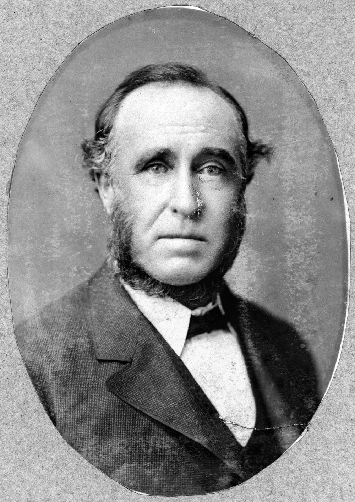
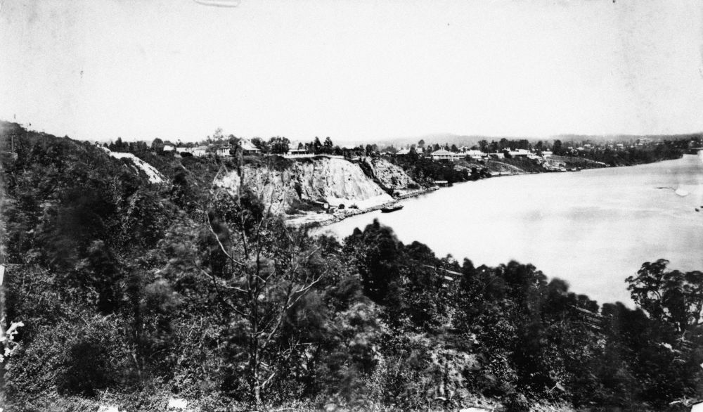

## John Sinclair <small>(9‑40‑5)</small>

John Sinclair was born in Lanarkshire, Scotland on 8 December 1827, the son of John Sinclair and Jane Smith. He married Jane Kelman in Brisbane on 11 August 1857. They had six children four of whom died in infancy. His wife Jane died in Brisbane on 11 February 1872. On 14 January 1888 in Brisbane, John Sinclair remarried to Constance Isabel Georgina Geoghegan. However, Constance died at their home, Delholm, Kangaroo Point on 21 May 1893. 

Sinclair died at Kangaroo Point, on 5 May 1906 aged 79 years and was buried here, together with Constance and his two adult children Margaret and James. John Sinclair was an Alderman of the Brisbane Municipal Council for the ward of Kangaroo Point from 1871—1882 and 1886—1887. He was Mayor of the Brisbane Municipal Council in 1880 and 1881.

{ width="27.4%" }  { width="66%" }  

*<small>[John Sinclair](http://onesearch.slq.qld.gov.au/permalink/f/1upgmng/slq_alma21218160620002061) — State Library of Queensland.</small>*  
*<small>[View of the Kangaroo Point cliffs, Brisbane, ca. 1890](http://onesearch.slq.qld.gov.au/permalink/f/1upgmng/slq_alma21256753480002061) — State Library of Queensland.</small>*
