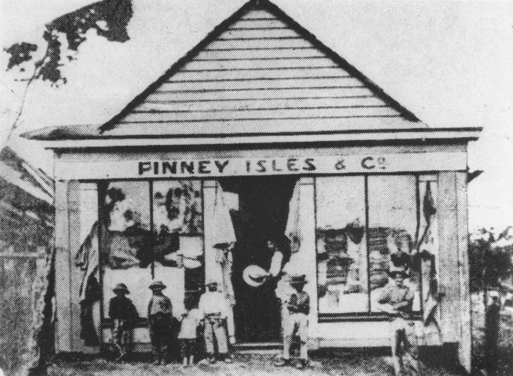

## John Tutty <small>[(13‑59‑11)](https://brisbane.discovereverafter.com/profile/31827132 "Go to Memorial Information" )</small>

Irish-born John Tutty (1844-1879) arrived in Brisbane around 1864. His parents were Edward Tutty and Frances Green. He married Alice Ross in 1872 in Brisbane. In 1873 in partnership with Robert Finney, Tutty and Finney took over the Fortitude Valley store of Finney Isles when that business moved to Queen Street. John was 35 when he died from a head injury from a fall at his home.

<figure markdown>
  { width="70%"  class="full-width" }
  <figcaption markdown>[Finney and Isles store, Fortitude Valley, ca. 1868](https://onesearch.slq.qld.gov.au/permalink/61SLQ_INST/dls06p/alma99183512248602061) — State Library of Queensland.</figcaption>
</figure>