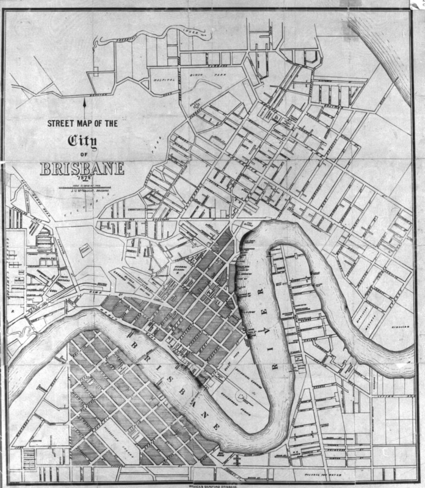

## John Ure McNaught <small>[(13‑55‑6)](https://brisbane.discovereverafter.com/profile/31819530 "Go to Memorial Information" )</small>

Stationer, bookseller, bookbinder, account book manufacturer, publisher, and lithographer, John McNaught was born in Brisbane on 30 May 1850. His parents, Daniel and Barbara (née Ure) McNaught and his older brother Daniel had arrived in Moreton Bay in 1848 on the *Artemisia* from Scotland. John married Eliza Ann Bothamley on 18 Jun 1873 in Brisbane. He was a long-time Toowong resident and was living at *Kalangur*, Augustus Street Toowong at the time of his death on 24 September 1924.

<figure markdown>
  { width="70%"  class="full-width" }
  <figcaption markdown>[Street map of the city of Brisbane, Queensland, 1878](https://onesearch.slq.qld.gov.au/permalink/61SLQ_INST/dls06p/alma99184004737002061) published by J.U. McNaught — State Library of Queensland.</figcaption>
</figure>
